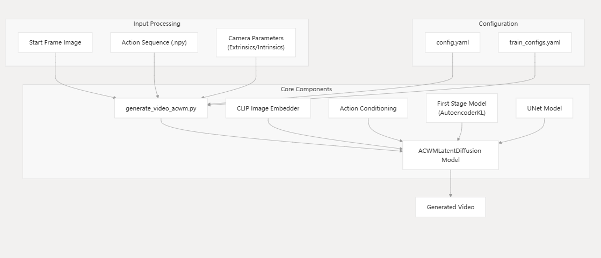

# EnerVerse-AC 仓库概览

> **复现边界：**已运行仓库提供的 inference example；原记录未保存 commit SHA，因此结构说明可能随上游变化，复现前应先补记 commit。

## 一句话总结

EnerVerse-AC 当前公开仓库主要提供 single-view action-conditioned world model inference：输入起始画面、未来机器人动作和相机参数，生成未来视觉帧，并非完整训练代码。

## 数据流

```text
image / video
  → VAE latent
text / image semantics
  → CLIP context
robot action
  → Resampler → cross-attention tokens
ray map / trajectory map
  → VAE or spatial encoding → latent concat
DDIM sampler + 3D UNet
  → predicted video latent
VAE decoder
  → future frames
```

## 仓库分层

| 层次 | 主要职责 |
|---|---|
| `main/` | 单 case 与批量推理入口 |
| `configs/` | 模型、VAE、CLIP、chunk 与采样配置 |
| `lvdm/data/` | action、相机、ray map 和 normalization |
| `lvdm/models/` | latent diffusion、DDIM 和条件组织 |
| `lvdm/modules/` | UNet、attention、VAE、action/ray/trajectory 模块 |

## 关键条件通路

三类都与动作或几何有关，但进入 UNet 的路线不同：

- action vector：经 Resampler 变成 cross-attention token；
- trajectory image：可视化关键点轨迹，经 VAE 进入 latent concat；
- ray map：相机 origin 与 direction 的空间编码，进入 latent concat。

因此做 action ablation 时需要分别消融这些条件，不能只把一条 action tensor 置零就认为模型完全没有动作信息。

## 结构图与运行结果



*结构图来自原仓库阅读记录。*

[示例推理视频](../../assets/implementations/enerverse-ac/example-rollout.mp4)

原记录使用 4 张 RTX 5090 运行官方 example，但没有保存软件版本、commit 和完整命令；这些信息应在下一次复现时补齐。

## 已知限制

- 公开仓库以推理为主，不能据此完整还原训练过程；
- 没有固定 commit，代码行级说明可能随上游更新失效；
- 单个成功 example 不能证明 action controllability；
- 多路条件可能互相替代，需要分路干预。

## 关联笔记

- [源码深读](code-walkthrough.md)
- [Action conditioning 专题](../../topics/action-conditioning.md)
- [Action controllability 评估设计](../../research/action-controllability-evaluation.md)
