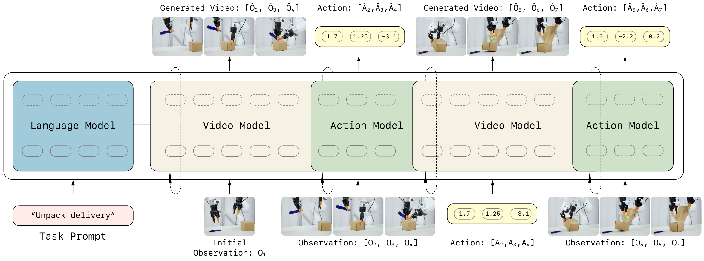
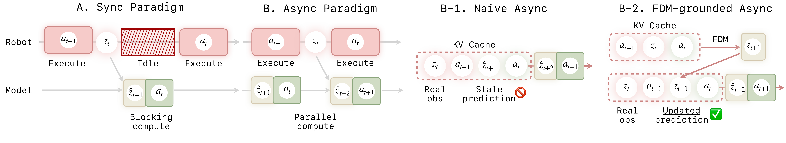
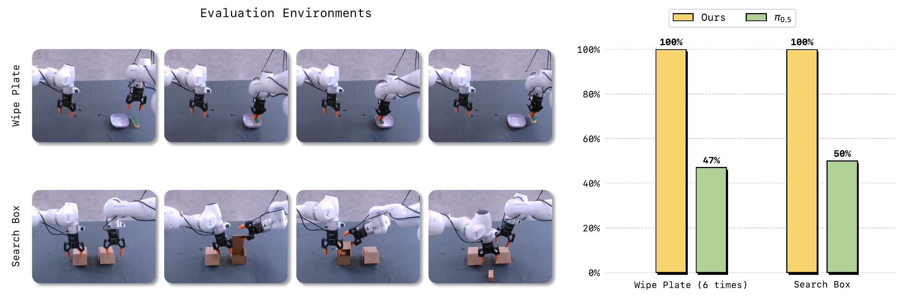
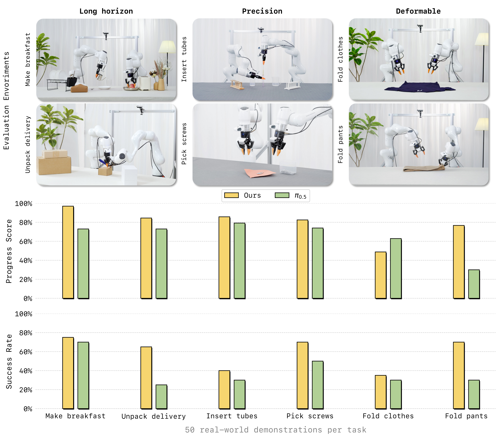

# LingBot-VA 1.0：Causal World Modeling for Robot Control

> **证据边界：**结构、指标与消融来自 arXiv v1；“world-action policy”等定位属于阅读理解。

## 一句话总结

LingBot-VA 不直接从当前观察回归动作，而是先生成未来视觉状态，再通过 inverse dynamics 产生 action chunk，并在异步执行中用真实观察纠正想象。

## 论文明确内容

### Video-action 双流

视频主干由 Wan2.2-5B 初始化，动作分支参数更小。两条模态流保留各自的 QKV 与 FFN，并通过交错 token 和共享 attention 交换信息。视频和动作都以 flow matching 生成；视频帧率较低，而两个视觉 latent 之间对应一组高频机器人动作。

*来源：原论文 Figure 2。[矢量原图](../../assets/papers/lingbot-va-v1/source/video-action-architecture.pdf)*

### Chunk-level autoregression 与闭环执行

训练采用 chunk-level autoregression：chunk 内并行，chunk 间 causal。Noisy History Augmentation 让动作分支能够使用尚未完全去噪的未来视觉 latent。

异步部署时，机械臂执行当前 action chunk，模型并行预测下一 chunk。朴素异步容易沿用 stale prediction；FDM-grounded step 使用最新真实观察和正在执行的动作重新预测视觉结果，再更新 KV cache。

*来源：原论文 Figure 4。[矢量原图](../../assets/papers/lingbot-va-v1/source/asynchronous-execution.pdf)*

### 结果

- RoboTwin 2.0 的 50 个任务上报告 Easy 92.93%、Hard 91.55%。
- LIBERO 四个 suite 的平均成功率为 98.5%。
- 六个真机任务使用每任务 50 条 demonstration 适配。
- FDM-grounded async 与同步成功率接近，但任务完成速度约快两倍；朴素异步明显退化。

*来源：原论文 Figure 9。[矢量原图](../../assets/papers/lingbot-va-v1/source/temporal-memory.pdf)*

*来源：原论文 Figure 5。[矢量原图](../../assets/papers/lingbot-va-v1/source/real-world-results.pdf)*

## 我的理解

未来视觉状态在目标与低维动作之间充当中间语言，可以同时表达物体状态、机械臂轨迹和局部结果。主策略路径更接近“期望未来 → inverse dynamics → action”，因此比经典的 `state + action → next state` forward model 更像 world-action policy。

teacher forcing 在闭环机器人中并非完全不合理，因为每执行一段动作都能重新得到真实观察。真正的风险出现在异步提前想象时，这也是 FDM re-grounding 的作用。

## 推测与问题

- 视觉上合理的未来不一定对应物理上可执行的动作。
- 视觉状态缺少触觉、力和音频，对接触丰富任务并不完整。
- 任务成功率无法直接回答预测画面是否忠实受 action 控制。

## 关联笔记

- [LingBot 系列演化](../../series/lingbot-series.md)
- [Action conditioning 专题](../../topics/action-conditioning.md)
- [Action intervention 评估设计](../../research/action-controllability-evaluation.md)
