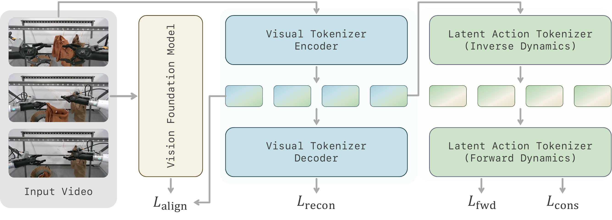
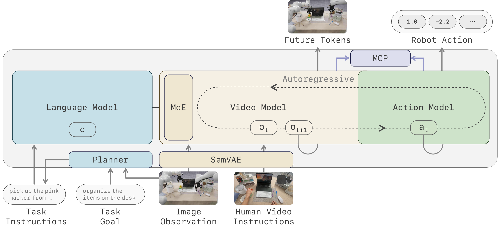
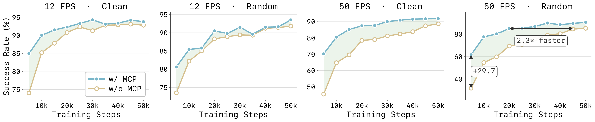
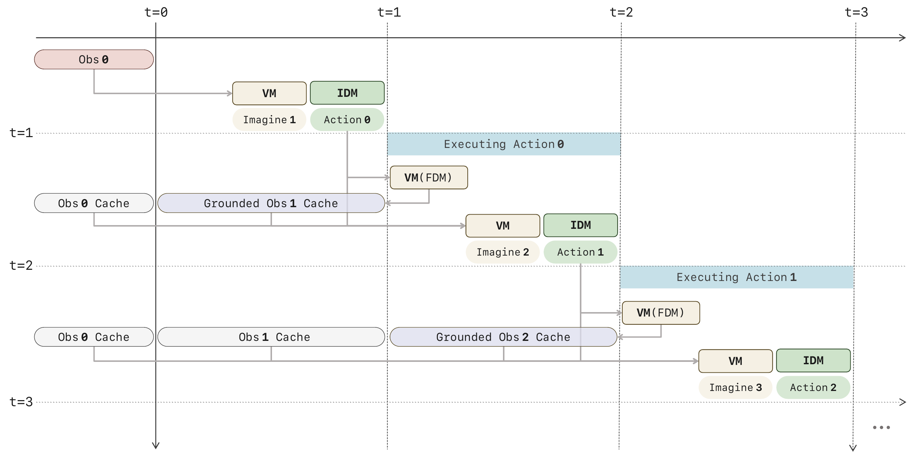
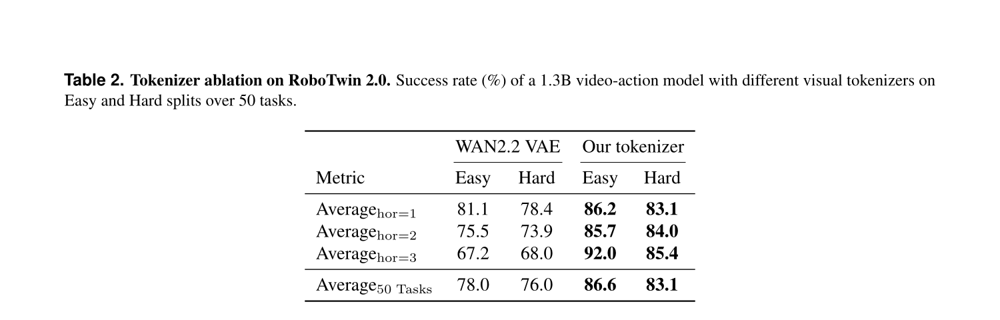

# LingBot-VA 2.0：Native Video-Action Pretraining

> **证据边界：**方法和结果来自 arXiv v1；对 latent action、ICL 与模块归因的讨论属于阅读判断。

## 一句话总结

2.0 保留“未来视觉预测—inverse dynamics—真实观察校正”的控制循环，但重做 tokenizer 与预训练，引入 latent action、MCP、人类视频和完整部署优化。

## 论文明确内容

### Semantic visual-action representation

视觉 tokenizer 同时优化重建和与冻结视觉 foundation model 的特征对齐，使 latent 不只保留纹理，也携带语义。随后 IDM 从相邻视觉 latent 推断低维 transition variable，FDM 用它重建下一 latent，并加入 backward consistency。

*来源：原论文 Figure 2。[矢量原图](../../assets/papers/lingbot-va-v2/source/semantic-tokenizer.pdf)*

无标签视频提供的是 latent action，而不是精确的机器人关节命令；真机部署仍需要机器人动作数据、统一动作表示和 embodiment-specific head。

### Native causal pretraining 与 MCP

由于 latent space 已变化，causal DiT 从头训练，并持续混合 T2I、T2V、video-action、ICL 和人机联合训练任务。video/action 两条流继续使用 MoT；video FFN 进一步改为 sparse MoE。

MCP 额外预测未来第 1–3 个 chunk，把梯度传回 backbone，避免高帧率下 next-step objective 只奖励复制相邻外观。相关 head 在标准推理时可以移除。

*来源：原论文 Figure 1。[矢量原图](../../assets/papers/lingbot-va-v2/source/system-overview.pdf)*

*来源：原论文 Figure 10。[矢量原图](../../assets/papers/lingbot-va-v2/source/mcp-convergence.pdf)*

### 人类视频、规划与执行

人类视频一方面通过带手部姿态的数据参与共同训练，另一方面可作为 video ICL 的视觉任务说明。高层 VLM planner 输出当前子任务，低层 VA policy 执行动作，两者异步通信。

Foresight Reasoning 延续 1.0 的异步闭环：执行当前动作时预测下一段，真实观察到达后覆盖 stale latent，并以 FDM grounding 更新 cache。

*来源：原论文 Figure 6。[矢量原图](../../assets/papers/lingbot-va-v2/source/foresight-reasoning.pdf)*

### 结果

- RoboTwin 2.0 上报告 Clean/Randomized 为 93.8%/93.4%，平均 93.6%；同表中的 VA 1.0 平均 92.2%。
- 新 tokenizer 在 horizon 1–3 的相同下游规模实验中均优于 Wan2.2 VAE。
- 论文报告 MCP 可减少达到相似精度所需的训练步数。
- 完整部署优化将论文中的 BF16 PyTorch async baseline 从 927 ms/chunk 降至 142 ms/chunk；225 Async Hz 不等于每秒执行 225 次完整大模型推理。

*来源：原论文 Table 2。*

## 我的理解

2.0 的核心变化是 representation-first：先让 latent 同时适合语义理解和状态转移，再期待视频预训练真正转化为控制能力。MCP 则把监督 horizon 拉长，针对高帧率下复制相邻帧的捷径。

## 推测与问题

- 从 passive video 学到的 latent action 未必唯一对应可执行控制。
- tokenizer、MoE、MCP、数据、planner 和系统优化同时变化，整体结果难以精确归因。
- 人类视频 ICL 的证据仍偏定性，尚需区分模型是在使用任务程序、物体语义还是外观对应。
- 视觉仍是核心模态，触觉与力反馈没有进入主要建模。

## 关联笔记

- [LingBot 系列演化](../../series/lingbot-series.md)
- [Latent action 专题](../../topics/latent-action.md)
- [Action controllability 专题](../../topics/action-controllability.md)
