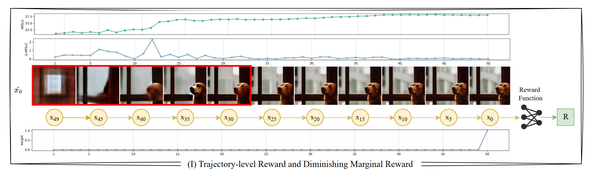
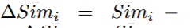
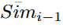
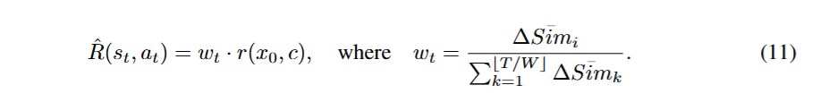
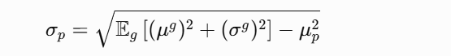
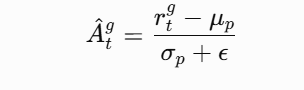
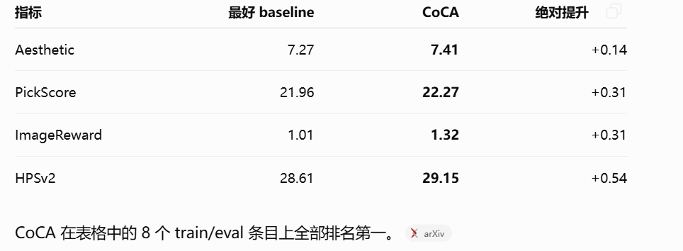
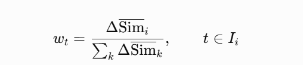
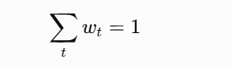

# CoCA：Step-level Reward for Free

> **证据边界：**“论文明确内容”复述论文方法和实验；“我的理解”与“待验证问题”包含对奖励守恒和迁移到视频生成的个人判断。

> **图表核验：**原始学习记录保留了公式与结果截图，但没有保存全部 equation/figure 编号；本文不猜测编号，待下一次对照 PDF 与作者实现时补齐，因此状态标记为 `revisit`。

## 一句话总结

CoCA 针对 RL 微调扩散模型时“所有去噪步骤共享同一个终局奖励”的粗粒度信用分配，用 latent similarity 的变化衡量不同去噪区间的重要性，不额外训练 critic 或奖励分解模型。

## 论文信息

- 论文：[arXiv:2505.19196](https://arxiv.org/abs/2505.19196)
- 研究场景：基于 RL 的 text-to-image diffusion fine-tuning
- 对比方法：DDPO、UCA、TDPO

## 论文明确内容

### 问题定义

DDPO 把去噪过程视为一个 MDP，中间 reward 通常为零，最终图像获得一次奖励。现有策略梯度随后用同一个终局信号更新所有 denoising timestep，但早期步骤更影响全局结构，后期步骤更偏向纹理和细节，均匀更新可能造成错误的信用分配。

*来源：原论文的问题示意图。*

### 相似度变化

论文计算每个中间 latent 与最终去噪结果的余弦相似度，并使用相邻状态之间的相似度增量作为该区间的贡献信号：

*来源：原论文方法公式。*

为降低单步噪声，轨迹被划分为长度为 $W$ 的不重叠窗口，先聚合窗口内的相似度，再计算窗口之间的变化。

*以上公式和示意均来自原论文；同一窗口中的 timestep 共享窗口权重。*

### 奖励重加权与归一化

相似度变化被用于重加权每个 timestep 的训练信号：

第一阶段在同一 prompt 的多条轨迹之间标准化最终奖励，形式类似 group-relative advantage：

$$
\hat A_g = \frac{r_g-\mu_p}{\sigma_p+\epsilon}.
$$

第二阶段再汇总同一 prompt 下各轨迹的逐步统计量，对 timestep reward 做归一化。

### 实验结果

论文在 Stable Diffusion v1.5 与 LoRA 上比较 DDPO、UCA、TDPO 和 CoCA，使用 Aesthetic Score、PickScore、ImageReward、HPSv2 四类奖励。前三类实验用 45 种动物 prompt 训练、8 种未见动物测试；HPSv2 使用更大的 prompt 集。

*来源：原论文主结果。论文报告的主要优势是达到相近 reward 时减少 reward query，约对应 1.25×–2× sample efficiency，而不是所有指标都出现大幅绝对提升。*

## 我的理解

CoCA 的优点是简单：它不调用额外模型，也不需要训练 timestep critic。它更像根据去噪区间的重要性重新缩放策略梯度，利用了 diffusion trajectory 自身已有的中间状态。

但 latent similarity 衡量的是“当前状态离最终图像有多近”，并不自动等价于“这个 timestep 对最终人类偏好奖励贡献了多少”。相似度增量是一种低成本启发式信用信号，而不是严格的因果贡献。

## 待验证问题

### 窗口权重是否保持奖励总量

论文给出的定义如下：

若每个窗口长度为 $W$，且窗口内每个 timestep 使用相同权重，按当前写法汇总后会额外乘上窗口长度：

通常所说的 reward redistribution 更希望满足总量保持：

若要严格保持总量，窗口权重可能需要额外除以 $W$：

这项疑问需要对照作者实现或后续版本再确认，因此笔记状态标记为 `revisit`。

### 能否迁移到视频生成

视频同时包含 diffusion timestep、内容时间帧、空间区域和动作片段四个潜在信用维度。直接把 CoCA 从图像搬到视频，可能只解决 denoising axis，而没有回答终局 reward 应该分给哪些帧和动作。

## 关联笔记

- [Diffusion 模型中的强化学习](../../../topics/rl-for-diffusion-models.md)
- [时序信用分配专题](../../../topics/temporal-credit-assignment.md)
- [视频生成中的多层级信用分配](../../../research/rl-for-video-generation/credit-assignment.md)
