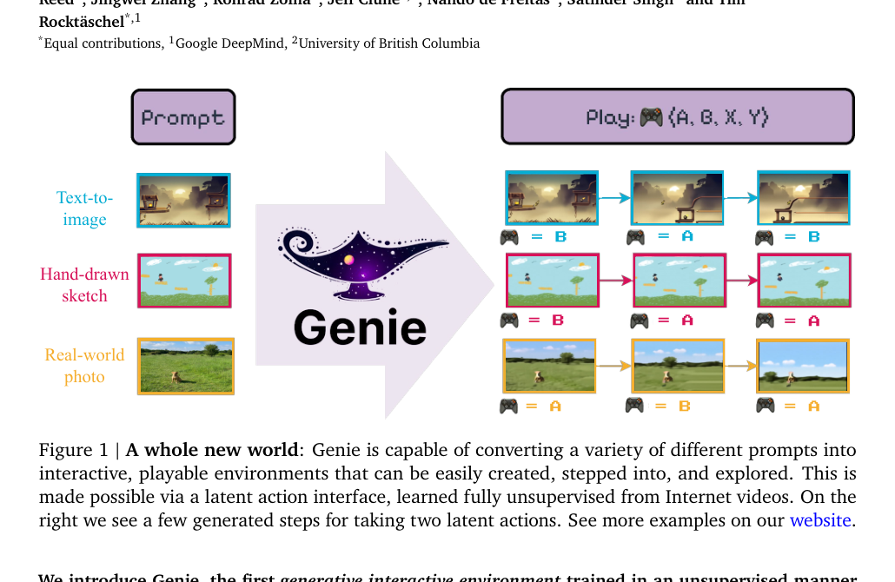
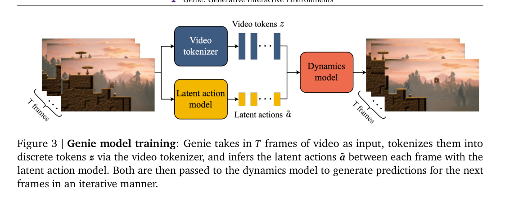
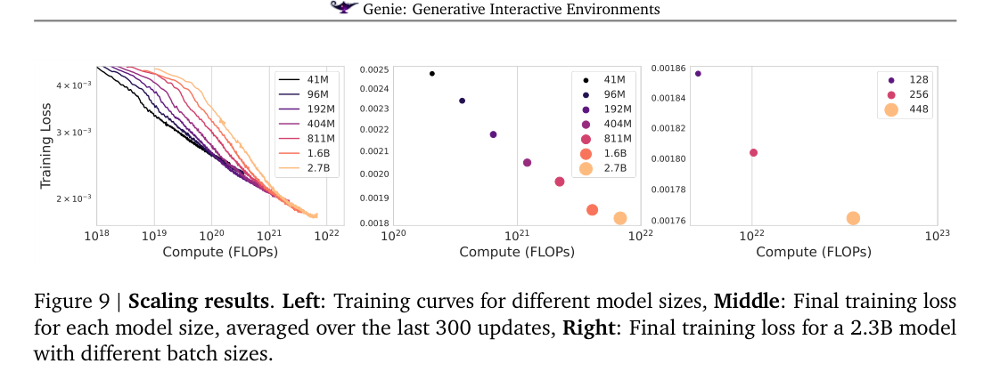
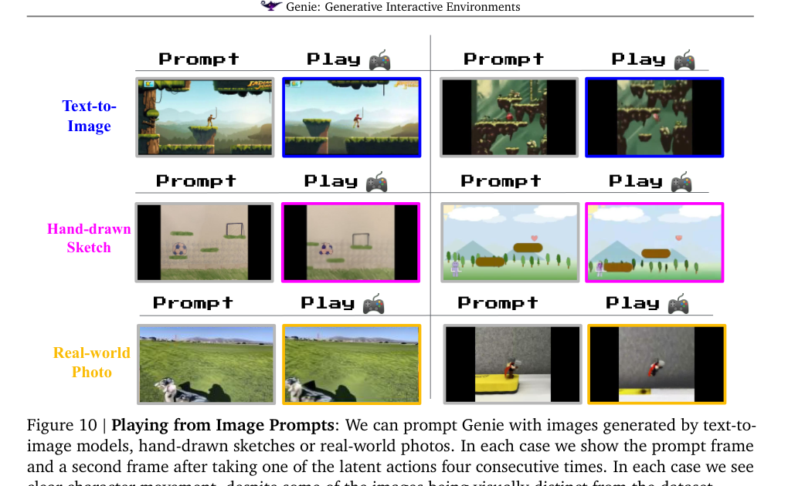
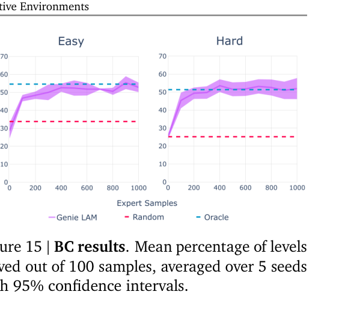

# Genie：Generative Interactive Environments

> **证据边界：**“方法、实验与结果”整理自论文；“我的理解、推测与问题”是阅读判断，不代表作者结论。

论文链接：[arXiv:2402.15391](https://arxiv.org/abs/2402.15391)

## 概述

Genie 想做的事情很直接：**只看没有动作标注的互联网视频，学出一个可以被人逐帧控制的生成环境。**

普通视频生成模型通常接收文本或首帧，然后一次性生成一段视频。用户可以决定“生成什么”，却很难在生成过程中每一帧都决定角色往左、往右、跳跃或移动。传统 world model 虽然可以接收动作，但训练数据必须包含成对的 `(observation, action)`，这类数据远少于普通视频。

Genie 的处理方式是先从相邻视频帧中自动推断一个离散的 **latent action**，再用这个 latent action 条件化下一帧生成。训练结束后，用户可以像使用一个只有 8 个按键的手柄一样选择 latent action，模型据此继续生成下一帧。

> 图源：原论文 Figure 1。不同输入图像经过 Genie 后，可以用离散 latent action 逐帧推进。

我感觉这篇论文最重要的点，是它把大量**没有动作标签的视频**变成了可能用于交互建模的数据；模型规模很大，但规模并不是这篇工作的核心。这个方向和 Dreamer 这一类 RL world model 的数据前提很不一样：Dreamer 默认能拿到真实动作，Genie 试图先把动作接口从视频中挖出来。

---

## 之前的方法问题在哪里

### 1. 普通视频生成缺少逐帧控制

文本条件通常控制整段视频的语义，例如“一个角色向前跑”。模型生成到中途后，用户不能随时切换动作。这样的模型可以生成视频，但还不能直接充当 agent 的交互环境。

### 2. 传统 world model 依赖动作标签

标准 action-conditioned world model 学习：

$$
p(x_{t+1}\mid x_{\le t},a_{\le t})
$$

训练时必须知道视频里每一步执行了什么动作。互联网视频只有画面，通常没有同步的键盘、手柄或机器人控制信号。直接使用真实 action 作为条件，会把训练数据规模限制在少数游戏日志、仿真轨迹或机器人数据集上。

### 3. 从视频中恢复动作存在不可辨识性

相邻帧发生变化，不一定都是 agent 主动动作造成的：

- 角色可能自己下落；
- 相机可能滚动；
- 敌人和背景也在运动；
- 同一个真实动作在不同状态下会产生不同视觉变化。

所以 latent action 不能简单理解成“从光流中读出向左或向右”。它必须提取对下一帧预测最有帮助、同时又足够紧凑的变化因素。

---

## Method（方法）

Genie 由三个主要部分组成：

1. **Video Tokenizer**：把视频帧压缩成离散 token；
2. **Latent Action Model（LAM）**：从前后帧中推断离散 latent action；
3. **Dynamics Model**：根据历史视频 token 和 latent action 生成下一帧 token。

> 图源：原论文 Figure 3。图中还包含 ST-Transformer、LAM 与 tokenizer 的结构示意。

### 1. ST-Transformer：把空间注意力和时间注意力拆开

如果把一段视频中的所有 patch token 放进普通 Transformer，自注意力开销会随着 token 总数平方增长。Genie 在各个模块中使用 Spatiotemporal Transformer：

- spatial attention：同一帧内部的 patch 互相注意；
- temporal attention：同一空间位置在不同时间之间互相注意；
- temporal attention 使用 causal mask，只看当前和过去帧。

这种分解让主要计算量随帧数近似线性增长，更适合长视频。它也保留了两类关系：一帧内部的物体结构，以及同一位置随时间的变化。

### 2. Video Tokenizer：把像素变成离散视频 token

Tokenizer 使用带 ST-Transformer 的 VQ-VAE。给定视频：

$$
x_{1:T}=(x_1,x_2,\ldots,x_T),
$$

编码器输出离散表示：

$$
z_{1:T}=(z_1,z_2,\ldots,z_T).
$$

主模型配置中，tokenizer 约 200M 参数，codebook 有 1024 个 code，每个 code 的 embedding dimension 为 32。

这里的 tokenizer 不只是逐帧压缩。由于编码器包含时间注意力，一个时刻的 token 可以吸收之前帧的信息，有利于保留运动和时间一致性。

### 3. Latent Action Model：从视频中自己找出“按键”

LAM 的训练形式可以理解为一个带离散瓶颈的 inverse-dynamics autoencoder。

编码器看到历史帧和下一帧：

$$
\tilde a_t = E(x_{\le t},x_{t+1}),
$$

然后把连续输出量化到一个很小的 VQ codebook。论文主配置只保留 **8 个 latent action code**。

解码器只接收历史帧和 latent action：

$$
\hat x_{t+1}=D(x_{\le t},\tilde a_t),
$$

并尝试恢复真实下一帧。由于解码器看不到 $x_{t+1}$，编码器必须把“从当前历史到下一帧最关键的变化”塞进 $\tilde a_t$。codebook 又非常小，因此它不能无限制地记录下一帧细节，只能形成少量可复用的变化模式。

LAM 采用 VQ-VAE 类目标，核心可写成：

$$
\mathcal L_{\text{LAM}}
=
\mathcal L_{\text{recon}}
+
\left\|\operatorname{sg}[e]-e_k\right\|_2^2
+
\beta\left\|e-\operatorname{sg}[e_k]\right\|_2^2,
$$

其中 $e$ 是编码器输出，$e_k$ 是最近的 codebook 向量，$\operatorname{sg}$ 表示 stop-gradient。

一个容易忽略的细节是：**LAM 的 decoder 只用于给 latent action 提供训练信号。正式推理时，除了 VQ codebook，LAM 主体会被丢弃，latent action 由用户直接选择。**

### 4. Dynamics Model：用 MaskGIT 生成下一帧

Dynamics Model 接收历史视频 token 和 latent action embedding，预测被 mask 的下一帧 token：

$$
p_\theta(z_{t+1}\mid z_{\le t},\tilde a_{\le t}).
$$

它是 decoder-only MaskGIT，而不是从左到右逐 token 生成。训练时随机 mask 一部分目标 token，用 cross-entropy 恢复；推理时经过多轮并行迭代逐渐补全下一帧。论文设置每帧进行 25 次 MaskGIT refinement。

动作在模型中以 additive embedding 的形式加入。作者发现这比简单把动作 token 拼接到帧 token 后面更有利于 controllability。

### 5. 训练顺序

整个训练分为两阶段：

1. 先单独训练 Video Tokenizer；
2. 冻结 tokenizer，联合训练 LAM 和 Dynamics Model。

Dynamics Model 使用的是 LAM 推断出的离散动作，并对动作分支 stop-gradient，防止 Dynamics Model 反过来把 LAM 推向一些只方便降低生成损失、却没有可解释控制意义的编码方式。

### 6. 推理时怎么“玩”

给定一张初始图像：

1. tokenizer 把初始图像编码为 $z_1$；
2. 用户选择一个整数动作 $a_1\in\{1,\ldots,8\}$；
3. 从 VQ codebook 取出动作 embedding；
4. dynamics model 生成 $z_2$；
5. tokenizer decoder 把 $z_2$ 解码成下一帧；
6. 用户继续选择下一步动作。

开始时用户并不知道 8 个按钮分别表示什么，需要像试玩新手柄一样试几次。论文观察到同一个 latent action 在不同输入中往往有相近的语义，例如向上、向下、向左。

---

## 数据和训练规模

论文先收集了超过 20 万小时的公开互联网游戏视频，再经过平台游戏过滤流程，最终用于主模型训练的是约 **3 万小时、680 万段 16 秒视频**，分辨率为 $160\times90$、10 FPS。

主模型包括：

- Video Tokenizer：约 200M；
- LAM：约 300M；
- Dynamics Model：10.1B；
- 总参数量：约 10.7B，论文中通常取整写作 11B。

Dynamics Model 使用 256 TPUv5p、batch size 512、训练 125k steps，总计处理约 942B tokens。这个训练规模决定了 Genie 更像一个 foundation-model 级别的研究展示，不是普通实验室容易完整复现的项目。

---

## Results（结果）

### 1. Scaling：模型越大，训练损失持续下降

作者训练了 41M 到 2.7B 的多种 Dynamics Model。模型规模和 batch size 增大时，最终训练 loss 都继续下降，没有明显饱和。

> 图源：原论文 Figure 9。这里证明的是生成建模 loss 的 scaling，并不等价于交互能力按相同比例提升。

这部分结果可以支持“架构还能继续吃计算量”，但它没有直接回答 latent action 是否更可靠、长时间滚动是否更稳定。

### 2. OOD image prompt：不只会复刻训练集画风

主模型只在 2D platformer 视频上训练，但测试时可以接收：

- 文生图模型生成的场景；
- 手绘草图；
- 真实照片。

连续执行同一个 latent action 后，图中的主体通常会产生游戏化运动。

> 图源：原论文 Figure 10。

这一结果视觉上很有吸引力，但主要是定性展示。它说明模型在短期内能把 OOD 图像“解释成可玩的平台游戏”，还不能证明模型理解了真实照片中的完整物理规律。

### 3. Robotics：无动作标签也能形成稳定控制方向

作者还在去掉动作标签的机器人视频上训练了一个 2.5B 模型，测试 FVD 为 82.7。相同 latent action 在不同初始状态下能够表现出近似的 up、down、left 等语义，还能生成机械臂与软包装袋的形变互动。

这里说明 LAM 的思路不只适用于平台游戏。不过机器人的动作空间远比 8 个离散 code 复杂，这个实验更接近“低维控制因素能否被挖出”的验证，还不是通用机器人 world model。

### 4. Latent action 能否迁移到真实动作

在 CoinRun 实验中，作者：

1. 用冻结的 LAM 给无动作标签的专家视频自动标注 latent action；
2. 训练 policy 根据 observation 预测 latent action；
3. 再用少量带真实动作标签的数据建立 `latent action → real action` 映射。

在 easy 和 hard 设置中，使用约 200 条带标签专家样本后，LAM-based policy 的表现接近直接使用真实专家动作训练的 oracle BC。

> 图源：原论文 Figure 15。

这个结果很值得注意，因为它说明 latent action 不只是让生成视频产生差异，还携带了一部分可迁移的行为信息。不过它仍然需要少量真实动作来完成最终 grounding，并没有完全消除 action label。

---

## Genie 和 Dreamer 的关系

两者都叫 world model，但任务设定差别很大。

| 方面 | Dreamer 系列 | Genie |
|---|---|---|
| 数据 | agent 与环境交互得到图像、动作、奖励 | 主要是无动作、无奖励的视频 |
| world model 条件 | 已知真实 action | 自动学习 latent action |
| 是否训练 actor/critic | 是 | 主模型没有 |
| 主要目标 | 在 imagined latent trajectories 中学习策略 | 生成可被 latent action 控制的交互视频 |
| 输出重点 | return 和任务成绩 | 画面、可控性、交互轨迹 |
| 主要风险 | model bias 影响策略 | latent action 语义和长时一致性不足 |

因此，Genie 本身还不是一个完整 RL agent。它更像是在解决 Dreamer 之前的数据问题：当动作日志不存在时，能不能先从视频里造出一个控制接口。

---

## 我的理解、推测与问题

### 1. Latent action 学到的是“可预测变化”，不一定是真实动作

LAM 的重建目标鼓励 code 记录对下一帧预测有用的信息，但以下因素都可能混进 latent action：

- 角色控制；
- 相机移动；
- 环境自动演化；
- 接触后产生的被动物理变化。

所以 action code 有语义，不代表它和真实控制变量一一对应。CoinRun 中再用少量动作标签做 mapping，实际上也说明 grounding 仍然是必要步骤。

### 2. 8 个离散动作既是优点，也是上限

codebook 小，用户才能像按手柄一样操作，也能迫使模型提取稳定模式。但它会丢失：

- 连续速度；
- 多关节机器人控制；
- 同一动作的幅度；
- 同时执行多个控制维度。

对平台游戏来说 8 个 code 够用，对机器人或真实世界任务可能需要分层 action、factorized code 或连续 latent action。

### 3. 论文的 controllability 指标还不够完整

论文使用 $\Delta_t\mathrm{PSNR}$ 比较“真实推断动作”和“随机动作”生成结果的差异。这个指标能检查动作有没有影响画面，却无法区分：

- 有意义的动作控制；
- 纯粹让画面随机变化；
- 主体动作变化；
- 背景或纹理变化。

更强的评估应该同时测：

- action consistency：同一个动作跨场景是否保持方向；
- action distinctness：不同动作是否真正可区分；
- state-dependent correctness：动作效果是否符合当前状态；
- long-horizon controllability：连续操作几十步后是否仍然听指令；
- causal influence localization：变化是否发生在应该受动作影响的区域。

### 4. 这篇论文很适合接 action controllability evaluation

Genie 的方法部分很大，但评估仍然以 qualitative results 和较粗的 PSNR-based 指标为主。一个务实的衍生方向是固定生成模型，系统做：

- original / zero / random / reversed latent action；
- 同动作跨 prompt 的运动方向统计；
- action intervention 后的光流、轨迹和语义变化；
- 长期 rollout 中 action effect 的衰减；
- latent action 与真实 action 的线性或少样本可对齐程度。

这个问题比重新训练 11B 模型现实得多，也和 action-conditioned world model 的核心问题直接相关。

### 5. 总体评价

我会把 Genie 定位成一篇**打开新数据来源的 world model 工作**。它最有价值的地方是“video-only → latent action → interactive generation”这一整条链路。现阶段的生成质量、长时稳定性和动作 grounding 都还不够成熟，但它确实把“互联网视频能不能变成 agent 的交互经验”从概念推进到了可运行的大模型系统。

## 关联笔记

- [Latent action 专题](../../topics/latent-action.md)
- [Action controllability 专题](../../topics/action-controllability.md)
- [Action intervention 评估设计](../../research/action-controllability-evaluation.md)
