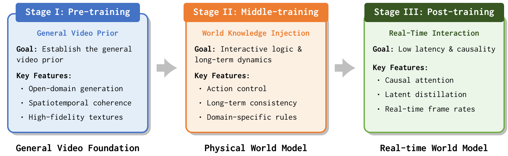
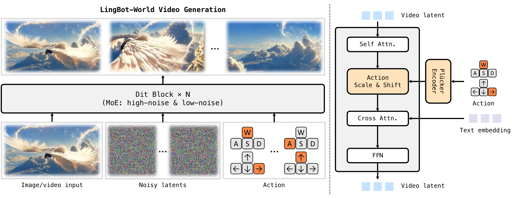
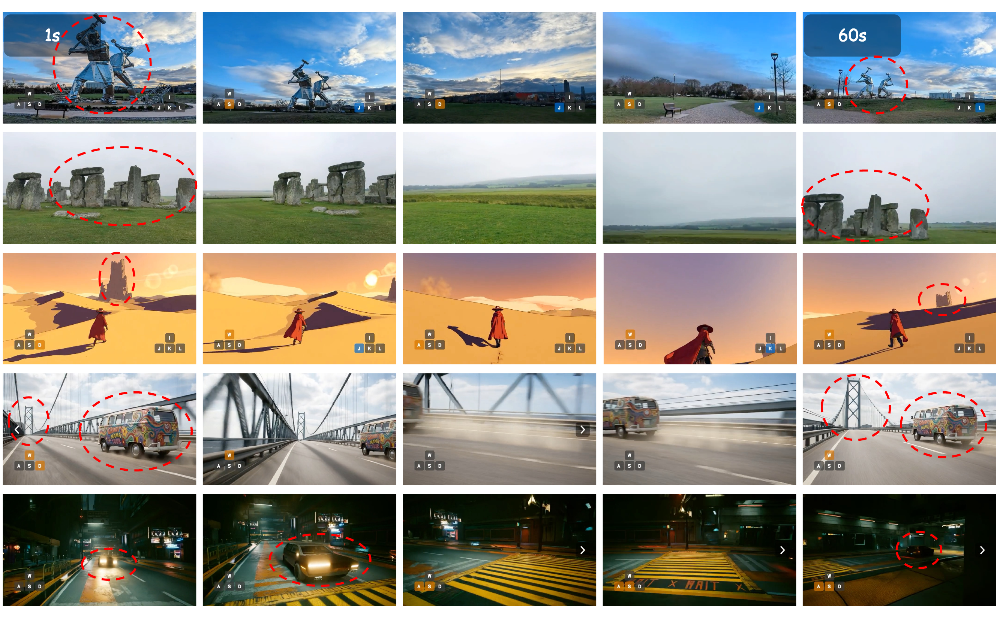

# LingBot-World 1.0：Advancing Open-source World Models

> **证据边界：**方法与指标来自 arXiv v1；对“记忆”和动作可控性的判断属于阅读理解。

## 一句话总结

这是一篇系统型工作：先建立开放域视频先验，再训练长视频、注入动作控制、改成 block-causal rollout，最后用 self-rollout、DMD 与部署优化得到实时版本。

## 论文明确内容

### 数据与三阶段训练

数据包括普通视频、带玩家输入的游戏数据和带精确相机参数的 Unreal Engine 合成数据。标注分别描述全局事件、静态场景和分段事件，以解耦外观、相机运动和局部变化。

训练分为三阶段：

1. 以 Wan2.2 I2V 建立开放域生成先验；
2. 从 5 秒逐步扩展到 60 秒，同时注入动作控制；
3. 将双向模型改成 block-causal，并蒸馏为少步实时模型。

*来源：原论文 Figure 4。[矢量原图](../../../assets/papers/lingbot-world-v1/source/training-pipeline.pdf)*

### 动作条件与长时 rollout

连续相机运动编码为 Plücker embedding，WASD 等离散动作编码为 multi-hot，再通过 AdaLN 调制 DiT。作者冻结主干，仅训练动作 adapter 与相关调制参数，以降低少量动作数据破坏开放域画质的风险。

*来源：原论文 Figure 5。[矢量原图](../../../assets/papers/lingbot-world-v1/source/action-conditioning-pipeline.pdf)*

为减轻 teacher forcing 与推理分布不一致，学生模型在自己生成的历史上继续 rollout，并以截断反向传播、DMD 和对抗训练控制漂移与细节质量。

### 结果

- Fast 版本在论文设置下达到约 480p、16 FPS。
- 作者展示最长约 10 分钟的连续生成，并测试离开视野约 60 秒后的地标与物体状态延续。
- 在作者构建的长视频 VBench 测试上，dynamic degree 报告为 0.8857。

*来源：原论文 Figure 12。[矢量原图](../../../assets/papers/lingbot-world-v1/source/long-term-memory.pdf)*

## 我的理解

这篇工作的价值在于给出“视频生成器如何逐步变成世界模型”的完整工程路线。冻结主干、单独学习控制接口，也体现了世界先验与控制能力之间的隔离思路。

论文把离开视野后的重现称为 emergent memory，但它仍依赖有限上下文中的视觉 token，没有持久地点身份、地图数据库或显式 loop closure。

## 推测与问题

- 动作跟随主要依赖定性展示，VBench 不能直接证明模型真正听从 action。
- “十分钟不明显崩坏”不等于长期保持同一个世界身份。
- block-causal attention 解决时间信息泄漏，不能单独证明物理因果性。

## 关联笔记

- [LingBot 系列演化](../../../comparisons/lingbot-series.md)
- [Action conditioning 专题](../../../topics/action-conditioning.md)
- [Action controllability 专题](../../../topics/action-controllability.md)
- [反事实动作评估设计](../../../research/action-controllability/evaluation-design.md)
