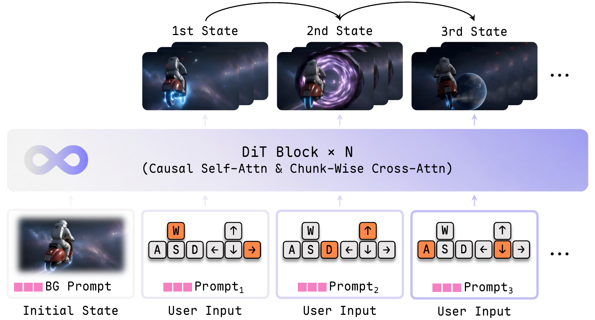
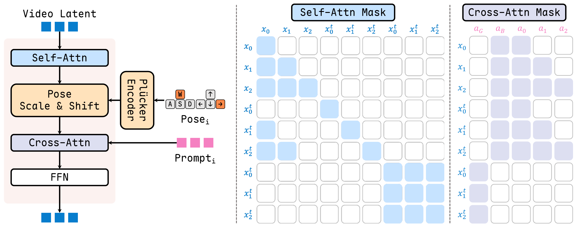
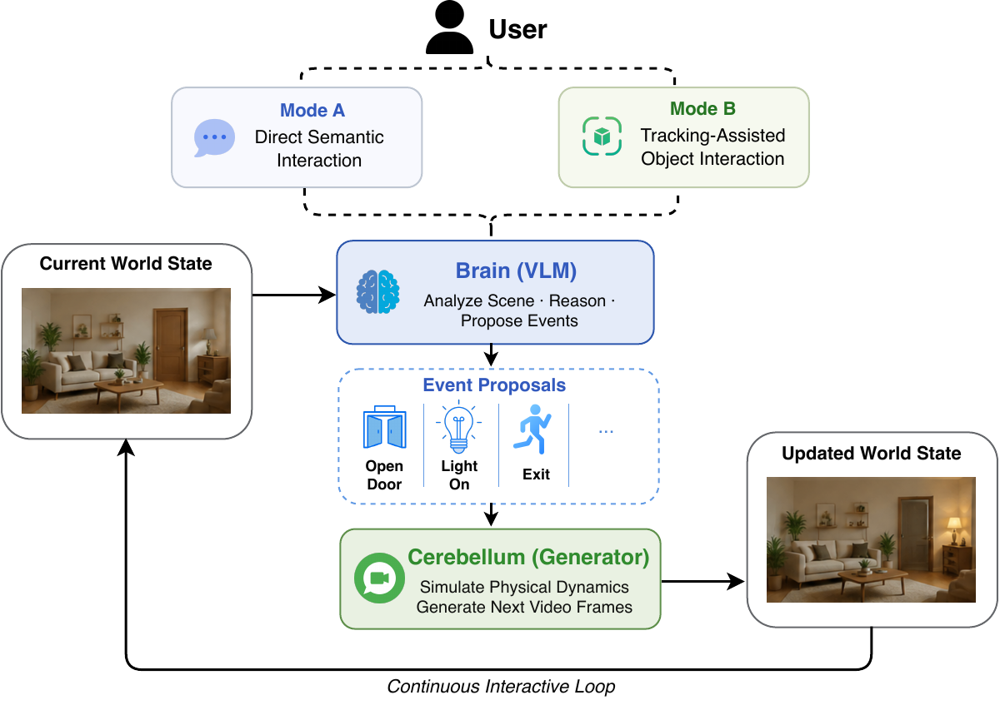
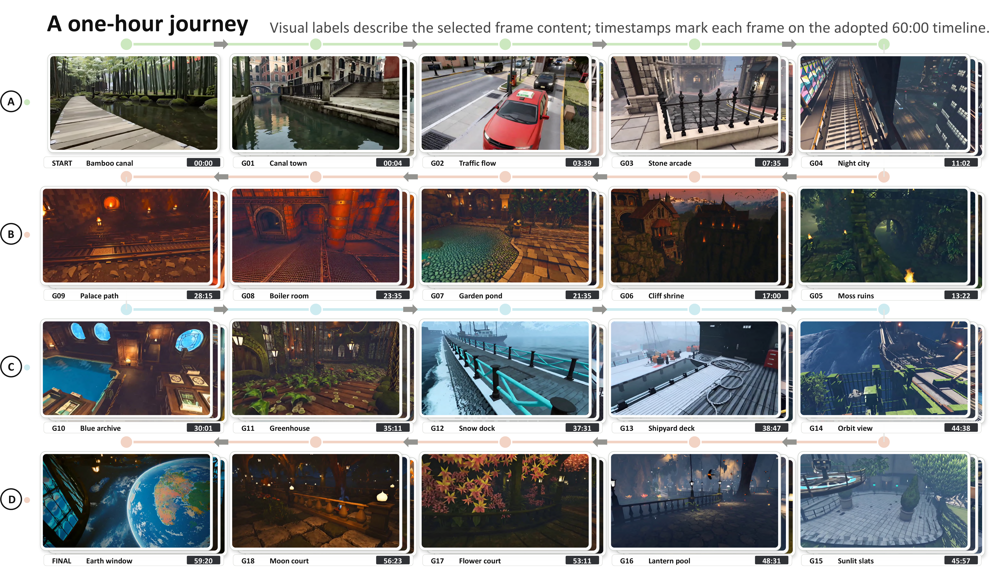

# LingBot-World 2.0：Infinite Worlds with Versatile Interactions

> **证据边界：**方法和系统声明来自 arXiv v1；对“无限世界”、持久身份和物理性的判断属于阅读理解。

## 一句话总结

2.0 把因果结构提前到预训练，用 MoBA、consistency distillation 和 long self-rollout DMD 提升长时稳定性，并把交互扩展到语义事件和对象级操作。

## 论文明确内容

### Causal world simulator

训练数据除全局 caption 外，还给每个 chunk 提供局部事件描述。模型从一开始就按 causal rollout 训练，而不是先训练双向教师、最后再改成 causal student。

*来源：原论文 Figure 3。[矢量原图](../../../assets/papers/lingbot-world-v2/source/causal-pipeline.pdf)*

MoBA 同时包含自回归区域和双向正则区域：前者阻止未来信息泄漏，后者降低模型只复制长历史、不真正预测变化的风险。

*来源：原论文 Figure 4。[矢量原图](../../../assets/papers/lingbot-world-v2/source/moba-attention-mask.pdf)*

### 交互与部署

相机轨迹继续以 Plücker embedding 注入；攻击、射箭、天气或实体变化等语义事件则通过 chunk-wise prompt 控制。VLM Director 负责把用户操作转成事件建议，Video Pilot 负责渲染连续视觉结果；对象级交互可结合 SAM 跟踪。

*来源：原论文 Figure 5。[矢量原图](../../../assets/papers/lingbot-world-v2/source/director-pilot-harness.pdf)*

部署侧结合少步一致性蒸馏、DMD、并行计算、异步 VAE decode、refiner 和动态 KV 调度。论文声称系统达到 720p、60 FPS，并提供 1.3B 轻量版本。

### 结果

作者展示超过一小时的连续生成与更丰富的动作空间，但核心证据仍以定性视频为主。论文没有充分量化动作响应精度、事件成功率、对象身份保持和物理正确性。

*来源：原论文 Figure 10。[矢量原图](../../../assets/papers/lingbot-world-v2/source/one-hour-rollout.pdf)*

## 我的理解

2.0 最重要的模型变化是教师本身原生 causal。教师若只擅长双向补全，学生蒸馏需要额外承担结构错配；先让 teacher 适应在线 rollout，再做 consistency 与 DMD 更合理。

Director–Pilot 解决的是语义逻辑与视觉渲染的接口，不会自动带来可靠物理引擎。VLM 可以提出“箭命中目标”，但生成器仍可能只画出视觉上合理的结果。

## 推测与问题

- “无限”表示可以持续生成，不代表无界记忆或固定世界身份。
- VLM Director 与 Video Pilot 的错误没有被独立评估。
- 60 FPS 依赖完整系统栈，不能与 1.0 的 16 FPS 直接视为纯算法四倍提升。

## 关联笔记

- [LingBot 系列演化](../../../comparisons/lingbot-series.md)
- [Action conditioning 专题](../../../topics/action-conditioning.md)
- [Action controllability 专题](../../../topics/action-controllability.md)
