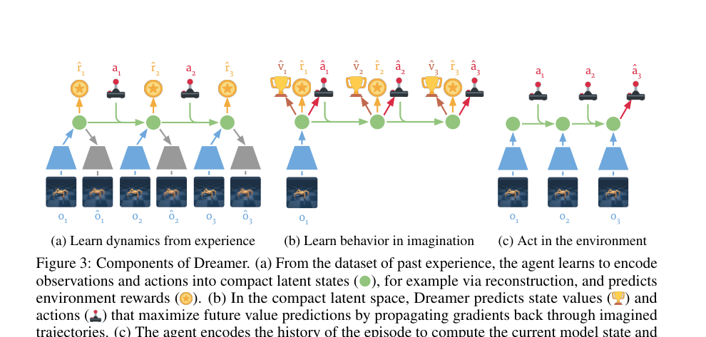
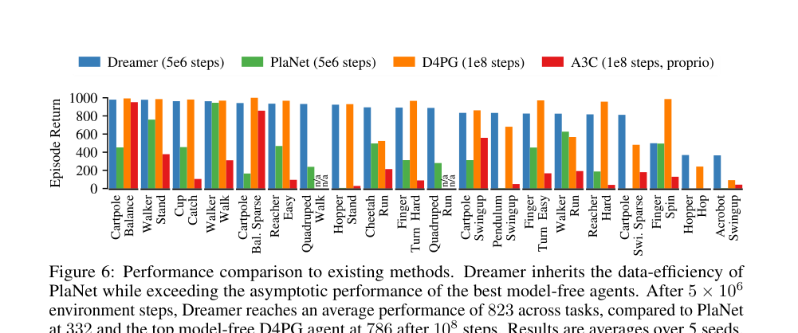
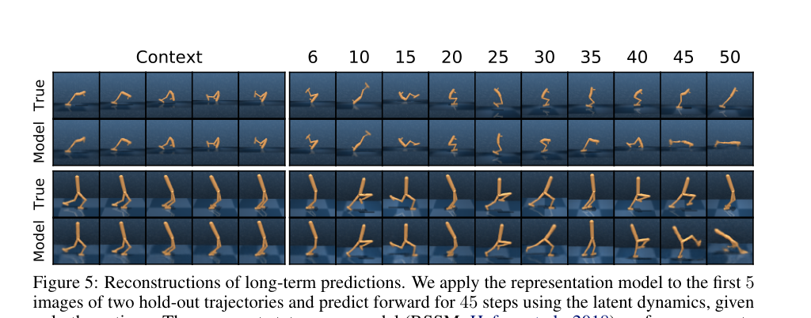

# DreamerV1：Dream to Control

> **证据边界：**“方法、实验与结果”整理自论文；“我的理解、推测与问题”是阅读判断，不代表作者结论。

论文链接：[arXiv:1912.01603](https://arxiv.org/abs/1912.01603)

## 概述

DreamerV1 提出了一套很经典的 model-based RL 路线：

1. 从真实环境经验中学习 latent world model；
2. 在 latent space 里 rollout 很多虚拟轨迹；
3. 用 imagined reward 和 value 训练 actor、critic；
4. 真正与环境交互时只执行 actor，不再做昂贵的在线规划。

它解决的核心问题是：**世界模型已经能预测未来了，策略究竟应该怎样从模型里学出来？**

PlaNet 等方法会在每个真实环境 step 上用 CEM 反复搜索动作序列。Dreamer 把这个在线优化过程“蒸馏”为一个 actor，并通过可微世界模型把多步 value gradient 直接传回 actor。

> 图源：原论文 Figure 3。左：学 world model；中：在想象轨迹里学 actor/critic；右：在真实环境中执行 actor。

我感觉 DreamerV1 的关键贡献不在 RSSM 本身。RSSM 在 PlaNet 中已经出现。DreamerV1 真正推进的是 **behavior learning in imagination**：如何在有限 imagination horizon 下，利用 critic 补上更远未来的价值，并通过模型反向传播训练策略。

---

## 之前的方法问题在哪里

### 1. 在线规划计算成本高

PlaNet 在执行每一步动作之前，都要：

- 采样大量候选动作序列；
- 用 world model rollout；
- 根据 imagined return 筛选；
- 迭代更新候选分布。

这种 Model Predictive Control 很吃计算，而且过去做过的搜索不会直接形成一个可复用 policy。Dreamer 训练出 actor 后，一次前向传播就能给出动作。

### 2. 只优化有限 horizon 内的 reward 会短视

假设 imagination horizon 为 $H$，只最大化：

$$
\sum_{\tau=t}^{t+H-1}\gamma^{\tau-t}\hat r_\tau,
$$

模型看不到 $H$ 之后的收益。对于走路这类即时奖励任务影响可能不大，但对 swing-up、跳跃、先蓄力后得分等任务，前几步可能没有奖励，却决定了很久之后的结果。

### 3. 无梯度规划没有利用神经网络模型的可微性

许多 model-based 方法担心模型误差，使用 CEM 等 derivative-free optimizer。这样比较稳，但世界模型、reward predictor 和 value network 都是神经网络，本来可以提供解析梯度。Dreamer 的想法是：只要 latent dynamics 足够可用，就直接把 return 对 action 的梯度穿过整条 imagined trajectory 传回 actor。

---

## Method（方法）

Dreamer 包含三个同时循环的阶段：

- Dynamics learning；
- Behavior learning；
- Environment interaction。

### 1. 从真实经验学习 latent dynamics

Replay buffer 中保存：

$$
(o_t,a_t,r_t).
$$

Dreamer 使用三个基础分布：

$$
\text{Representation:}\quad
p_\theta(s_t\mid s_{t-1},a_{t-1},o_t),
$$

$$
\text{Transition:}\quad
q_\theta(s_t\mid s_{t-1},a_{t-1}),
$$

$$
\text{Reward:}\quad
q_\theta(r_t\mid s_t).
$$

这里的 representation model 看得到当前真实观测 $o_t$，得到 posterior latent state；transition model 看不到 $o_t$，只能根据过去状态和动作预测 prior。真正做 imagination 时使用的是 transition model。

论文主要实验采用 RSSM：

- deterministic recurrent state：负责保存历史；
- stochastic latent state：表达当前不确定信息；
- observation decoder：重建图像；
- reward model：预测 reward。

world model 使用类似 sequential VAE 的目标：

$$
\mathcal J_{\text{REC}}
=
\mathbb E\sum_t
\left[
\log q_\theta(o_t\mid s_t)
+
\log q_\theta(r_t\mid s_t)
-
\beta D_{\mathrm{KL}}
\left(
p_\theta(s_t\mid \cdot,o_t)
\Vert
q_\theta(s_t\mid \cdot)
\right)
\right].
$$

图像重建不是为了在执行策略时真的渲染未来画面。它主要给 latent representation 提供密集训练信号，避免状态只记住少量 reward 相关信息。

### 2. 从 replay 中取真实 posterior state 作为 imagination 起点

Dreamer 不从一个固定初始状态开始想象。它先从 replay buffer 采样真实序列，编码得到很多 posterior states：

$$
s_t\sim p_\theta(s_t\mid s_{t-1},a_{t-1},o_t).
$$

然后从每个 $s_t$ 出发，在 world model 中展开长度为 $H$ 的轨迹：

$$
a_\tau\sim q_\phi(a_\tau\mid s_\tau),
$$

$$
s_{\tau+1}\sim q_\theta(s_{\tau+1}\mid s_\tau,a_\tau),
$$

$$
\hat r_\tau\sim q_\theta(r_\tau\mid s_\tau).
$$

这样一次真实 batch 可以产生大量 imagined trajectories。论文强调 latent rollout 内存小，可以并行生成数千条轨迹。

### 3. Actor 和 Critic 各自做什么

Actor：

$$
a_t\sim q_\phi(a_t\mid s_t),
$$

负责在 latent state 上选择动作。

Critic：

$$
v_\psi(s_t)
\approx
\mathbb E\left[
\sum_{\tau=t}^{\infty}
\gamma^{\tau-t}r_\tau
\right],
$$

预测从当前 latent state 出发，按照 actor 行动能获得的长期 return。

Critic 不是环境的一部分，也不负责生成下一状态。它只是给 imagined state 打一个“以后大概还能拿多少分”的估值。

### 4. 为什么需要 $\lambda$-return

只使用 imagined horizon 内的 reward，会忽略 horizon 后的价值；直接完全相信 critic，偏差又可能很大。Dreamer 使用 $\lambda$-return 混合不同长度的 $n$-step return。

$n$-step return 为：

$$
V_N^n(s_\tau)
=
\mathbb E\left[
\sum_{k=\tau}^{h-1}\gamma^{k-\tau}r_k
+
\gamma^{h-\tau}v_\psi(s_h)
\right],
\quad
h=\min(\tau+n,t+H).
$$

Dreamer 的 $\lambda$ target：

$$
V_\lambda(s_\tau)
=
(1-\lambda)
\sum_{n=1}^{H-1}
\lambda^{n-1}V_N^n(s_\tau)
+
\lambda^{H-1}V_N^H(s_\tau).
$$

直觉上：

- 小 $n$：更依赖 critic，方差较低，bias 较高；
- 大 $n$：更依赖 imagined rewards，bias 较低，但模型误差和随机性积累更多；
- $\lambda$：在二者之间做加权。

这一步让 Dreamer 即使只 imagination 15 步，也能考虑更远的未来。

### 5. Critic 怎么训练

Critic 回归 stop-gradient 后的 $\lambda$ target：

$$
\mathcal L_V(\psi)
=
\mathbb E
\left[
\sum_{\tau=t}^{t+H}
\frac12
\left(
v_\psi(s_\tau)
-
\operatorname{sg}[V_\lambda(s_\tau)]
\right)^2
\right].
$$

`stop-gradient` 很重要。target 在当前更新中被视为常数，否则 critic 可以通过同时移动预测和 target 得到不稳定的自我追逐。

### 6. Actor 怎么训练：梯度穿过 world model

Actor 的目标是最大化 imagined $\lambda$-return：

$$
\mathcal J_\pi(\phi)
=
\mathbb E
\left[
\sum_{\tau=t}^{t+H}
V_\lambda(s_\tau)
\right].
$$

由于 action 使用可重参数化的分布采样，且 transition、reward、value 都是可微神经网络，可以形成：

$$
\phi
\rightarrow a_\tau
\rightarrow s_{\tau+1}
\rightarrow \hat r_{\tau+1},v(s_{\tau+1})
\rightarrow V_\lambda.
$$

于是：

$$
\nabla_\phi \mathcal J_\pi
$$

可以沿整条 imagined trajectory 反向传播。这就是论文所说的 analytic value gradients。

更新 actor/critic 时 world model 参数被冻结。梯度可以“经过”模型传回 actor，但不会顺手修改 world model，避免策略为了获得高 imagined reward 而把模型本身改坏。

### 7. 真正与环境交互

训练好 actor 后，真实环境中只需要：

1. 把观测历史编码成当前 posterior state；
2. actor 输出动作；
3. 加探索噪声后执行；
4. 把新经验放回 replay buffer。

这里没有 CEM，也没有每一步重新规划。

---

## 一个具体例子：Acrobot Swing-up

初始状态下，杆子垂在下方。想要把它甩到上方，合理策略往往需要先向反方向摆动积累动能，早期动作可能没有即时 reward。

若 horizon 很短、没有 critic：

- imagined trajectory 只看到“向反方向摆没有得分”；
- actor 倾向于追求短期看起来更好的动作；
- 最终学不到完整 swing-up。

加入 critic 后，末端状态 $s_{t+H}$ 会得到：

$$
v_\psi(s_{t+H}),
$$

它估计“这个状态虽然现在没得分，但已经积累了有利动能，之后成功概率较高”。这个价值通过 $\lambda$-return 回传到更早动作，于是早期蓄力动作也能得到训练信号。

这和 credit assignment 有直接关系：早期动作即使没有即时 reward，也会通过 imagined transition 和 bootstrapped value 收到逐步传回的训练信号。

---

## Results（结果）

### 1. DeepMind Control Suite

论文在 20 个视觉控制任务上评估，统一使用图像输入和一套超参数。任务包含：

- 稀疏奖励；
- 接触动力学；
- 多自由度控制；
- 3D 场景；
- 较长时间依赖。

在 500 万 environment steps 后，Dreamer 跨任务平均分为 823；PlaNet 同样 500 万 steps 为 332；D4PG 使用 1 亿 steps 得到 786。

> 图源：原论文 Figure 6。

这个结果的含义不只是最终分数高。Dreamer 同时保留了 PlaNet 的数据效率，又避免了 PlaNet 在线 CEM 的大量计算。

### 2. 长期预测能力

> 图源：原论文 Figure 5。前 5 帧是 context，后面只给动作，不再给真实图像。

预测图像会逐渐模糊或偏离真实轨迹，但主体姿态和主要动力学还能维持一段时间。Dreamer 的 actor/critic 并不直接使用解码图像，它们使用 latent state，所以像素级误差并不一定完全等同于控制误差。

### 3. 长 horizon ablation

论文比较：

- Dreamer；
- 没有 value model、只优化 horizon 内 reward 的 actor；
- PlaNet 在线规划。

Dreamer 对 imagination horizon 更稳健，在 Acrobot、Hopper 等长时 credit assignment 任务上明显优于只看有限 reward 的版本。这个实验基本验证了 critic bootstrap 的必要性。

### 4. representation objective

作者比较三种 world model 学习信号：

- pixel reconstruction；
- contrastive estimation；
- reward prediction only。

pixel reconstruction 在多数任务上最好；contrastive 能解决一部分任务；只预测 reward 不够。说明在数据有限、reward 稀疏时，仅依赖任务奖励很难学到完整状态表示。

---

## 这篇论文在 Dreamer 系列里的位置

DreamerV1 建立了后续版本一直沿用的骨架：

$$
\text{Replay}
\rightarrow
\text{RSSM world model}
\rightarrow
\text{latent imagination}
\rightarrow
\text{actor/critic}.
$$

后续版本主要不是推翻这条路线：

- DreamerV2：把连续 Gaussian latent 改成 categorical latent，并增强 KL 和 actor gradient；
- DreamerV3：重点解决不同任务 reward scale、输入尺度和训练稳定性，使一套超参数跨域可用。

所以理解 DreamerV1 时，最需要抓住的是训练闭环，而不是后面版本中的各种稳定化 trick。

---

## 我的理解、推测与问题

### 1. Dreamer 的效果高度依赖 world model “在策略会去的地方”是否准确

actor 会主动寻找高 predicted return 的轨迹。如果 world model 在某些少见状态上预测错误，actor 可能学会利用模型漏洞。论文通过：

- imagination 从 replay posterior states 开始；
- rollout horizon 不设太长；
- 不断收集新真实数据更新模型；

来缓解这个问题，但没有从根本上消除 model exploitation。

### 2. 图像重建提供密集信号，也可能浪费容量

重建要求模型保存背景、纹理和光照等信息，而控制可能只关心物体位置、速度和接触状态。DreamerV1 的实验中 reconstruction 最好，说明当时它是可靠选择；这不等于 pixel reconstruction 永远是最优 world-model objective。

后来的 representation world model、self-supervised objective 和 predictive representation 工作，很多都在继续追这个问题。

### 3. analytic gradient 低方差，但会把 model bias 直接传给 actor

REINFORCE 类估计通常方差较高，但不需要对 transition 求导。DreamerV1 的 dynamics gradient 很直接，训练效率高；模型导数有偏时，actor 也会沿着错误方向快速更新。DreamerV2 在离散 Atari 上重新引入 REINFORCE，部分原因就在这里。

### 4. “latent imagination”不是生成可观看视频

训练 actor 时，Dreamer 只 rollout latent state、reward 和 continuation，不需要逐帧解码图像。observation decoder 主要用于训练 representation 和可视化。

这点和现在很多生成式视频 world model 有明显区别。Dreamer 关心的是“足够支持 control 的 latent dynamics”，不要求每一帧视觉上都达到视频生成模型的质量。

### 5. 总体评价

DreamerV1 是一篇把 world model 真正变成高效 policy-training environment 的工作。方法链路很完整，结果也强。它留下的主要问题是模型误差、representation learning 和跨域鲁棒性；DreamerV2/V3 基本都在沿着这些问题继续修。

## 关联笔记

- [Dreamer V1/V2/V3 演化比较](../../../series/dreamer-series.md)
- [RSSM 专题](../../../topics/rssm.md)
- [Latent imagination 专题](../../../topics/latent-imagination.md)
