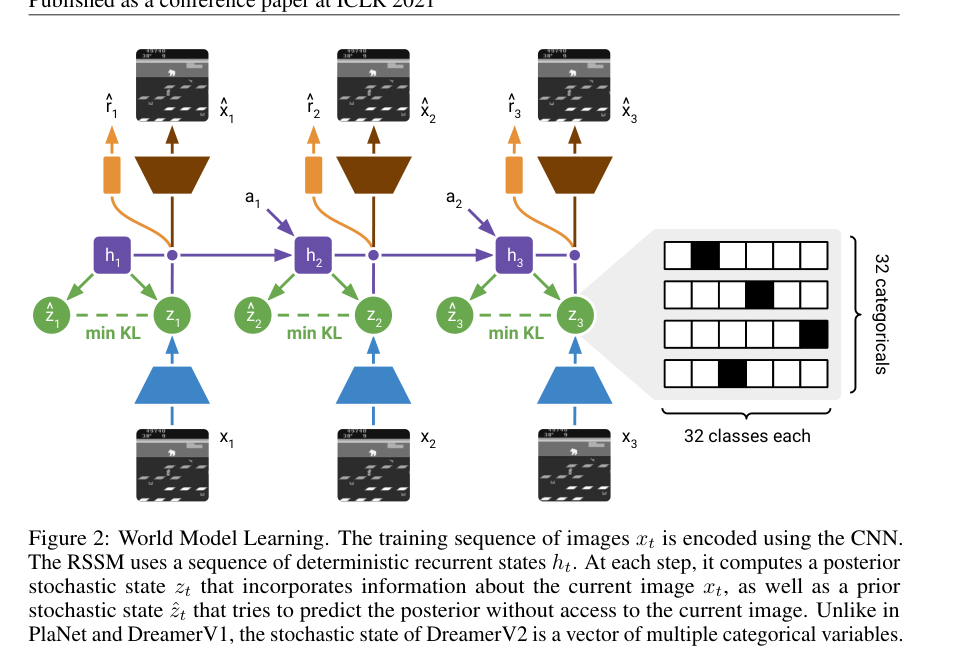
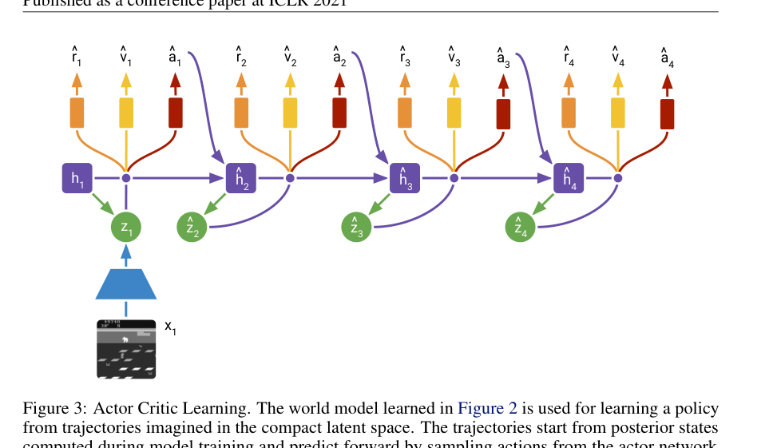
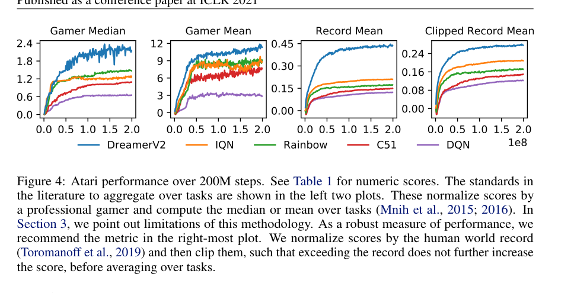
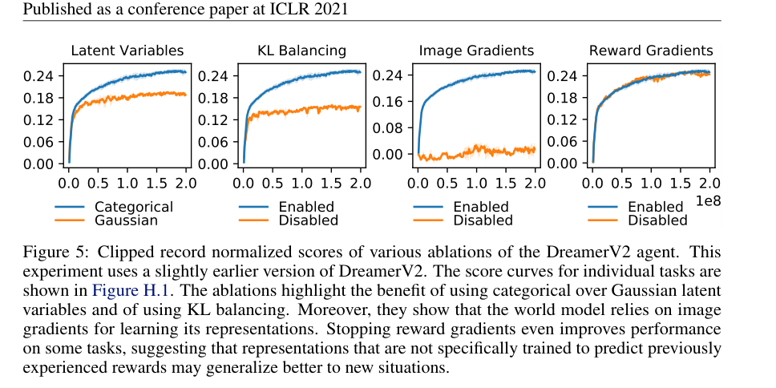

# DreamerV2：Mastering Atari with Discrete World Models

> **证据边界：**“方法、实验与结果”整理自论文；“我的理解、推测与问题”是阅读判断，不代表作者结论。

论文链接：[arXiv:2010.02193](https://arxiv.org/abs/2010.02193)

## 概述

DreamerV2 把 Dreamer 从连续控制推进到了 Atari。论文最醒目的结果是：它成为第一个**只在单独训练的 world model 内学习行为，并在 Atari 55 个游戏上达到人类水平聚合成绩**的 agent。

V2 没有换掉 Dreamer 的整体框架，仍然是：

$$
\text{real experience}
\rightarrow
\text{RSSM}
\rightarrow
\text{latent imagination}
\rightarrow
\text{actor/critic}.
$$

真正关键的改动主要有两个：

1. 把 DreamerV1 的 Gaussian stochastic latent 换成一组 categorical latent；
2. 用 KL balancing 更积极地训练 temporal prior。

此外，V2 的 actor 可以混合 REINFORCE gradient 和通过 world model 的 straight-through dynamics gradient，从而兼容离散 action。



> 图源：原论文 Figure 2。每一步同时存在看得到当前图像的 posterior $z_t$，以及只依赖历史的 prior $\hat z_t$。

---

## DreamerV1 到 Atari 时遇到了什么问题

### 1. Atari 的状态变化更离散、更突变

连续控制中的位置和速度通常平滑变化，Gaussian latent 比较自然。Atari 会出现：

- 进入新房间；
- 物体突然消失；
- 得分或生命状态跳变；
- 碰撞后模式瞬间切换。

单峰 Gaussian prior 很难表达这种多模态、非平滑的下一状态分布。

### 2. imagination 完全依赖 prior，prior 学不好就会崩

训练阶段 posterior 看得到当前图像，容易编码准确状态；推理和 imagination 阶段没有未来图像，只能依赖 prior。

标准 KL：

$$
D_{\mathrm{KL}}
\left[
q(z_t\mid h_t,x_t)
\Vert
p(z_t\mid h_t)
\right]
$$

既可以通过让 prior 追上 posterior 变小，也可以通过让 posterior 变得更模糊、更像一个差劲 prior 来变小。如果 early training 的 prior 很弱，优化可能牺牲 posterior 表示能力，而不是优先修好 dynamics。

### 3. 离散 action 不能直接使用普通 reparameterization

DreamerV1 在连续动作上使用可重参数化 Gaussian，value gradient 可以穿过 sampled action。Atari 动作是 categorical sample，普通采样不可微，需要 REINFORCE 或 straight-through estimator。

---

## Method（方法）

### 1. RSSM 结构保持不变，stochastic latent 改成离散变量

DreamerV2 的 compact model state 是：

$$
s_t=(h_t,z_t),
$$

其中：

- $h_t$：GRU 的 deterministic recurrent state；
- $z_t$：stochastic categorical state。

核心分布为：

$$
h_t=f_\phi(h_{t-1},z_{t-1},a_{t-1}),
$$

$$
z_t\sim q_\phi(z_t\mid h_t,x_t),
$$

$$
\hat z_t\sim p_\phi(\hat z_t\mid h_t).
$$

posterior $q$ 看得到图像 $x_t$；prior $p$ 只能根据历史 $h_t$ 预测。

论文使用 32 个 categorical variables，每个变量 32 类。采样后可以展平为长度 1024 的稀疏 one-hot 向量，其中只有 32 个位置为 1。

### 2. 为什么 categorical latent 可能更合适

论文没有声称已经从理论上证明原因，而是给出几种解释：

- categorical prior 可以更自然地拟合多模态 aggregate posterior；
- 稀疏表示可能有利于泛化；
- straight-through estimator 的梯度尺度可能更稳定；
- 离散状态更适合 Atari 中房间切换、物体消失等突变。

这里需要保持一点克制：实验明确说明 categorical latent 更好，但“为什么更好”仍然主要是 hypothesis。

### 3. Straight-through gradient

正向传播时，模型真正使用 one-hot sample：

```python
sample = one_hot(draw(logits))
```

反向传播时，用 softmax probability 的梯度替代离散采样梯度：

```python
probs = softmax(logits)
sample = sample + probs - stop_grad(probs)
```

数值上 `probs - stop_grad(probs)=0`，所以 forward 仍然是离散 sample；backward 时 `sample` 对 logits 的梯度等同于 `probs` 的梯度。

它是有偏估计，但方差低、实现简单。

### 4. world model objective

world model 同时预测图像、reward 和 discount：

$$
\mathcal L_{\text{model}}
=
\mathbb E_q\sum_t
\Big[
-\log p_\phi(x_t\mid h_t,z_t)
-\log p_\phi(r_t\mid h_t,z_t)
-\log p_\phi(\gamma_t\mid h_t,z_t)
+\beta\,D_{\mathrm{KL}}(q_t\Vert p_t)
\Big].
$$

discount predictor 用来预测 episode 是否继续。imagined return 会乘累计 predicted discount，减少已经很可能终止的轨迹对 actor/critic loss 的影响。

### 5. KL Balancing

标准 KL 可以拆成 prior cross-entropy 和 posterior entropy 的作用。DreamerV2 用 stop-gradient 分成两项：

$$
\mathcal L_{\mathrm{KL}}
=
\alpha
D_{\mathrm{KL}}
\left[
\operatorname{sg}(q_t)
\Vert
p_t
\right]
+
(1-\alpha)
D_{\mathrm{KL}}
\left[
q_t
\Vert
\operatorname{sg}(p_t)
\right].
$$

论文在 Atari 使用 $\alpha=0.8$。

第一项只更新 prior，让 prior 追 posterior；第二项只更新 posterior，让表示不要偏离 prior 太多。$\alpha>0.5$ 表示作者更重视先把 prior dynamics 学准。

这个设计很符合 Dreamer 的需求：behavior learning 完全在 prior rollout 中发生。posterior 即使重建很好，prior 预测不准，想象训练还是不能用。

### 6. imagined actor-critic

DreamerV2 从 replay 中的 posterior states 出发，使用 prior 展开 horizon $H=15$：

$$
\hat a_t\sim \pi_\psi(\hat a_t\mid \hat s_t),
$$

$$
\hat s_{t+1}\sim p_\phi(\hat s_{t+1}\mid \hat s_t,\hat a_t),
$$

其中 $\hat s_t=(\hat h_t,\hat z_t)$，实际 rollout 同时更新 deterministic state 和 categorical stochastic state。

critic 使用 $\lambda$ target：

$$
V_t^\lambda
=
\hat r_t
+
\hat\gamma_t
\left[
(1-\lambda)v_\xi(\hat s_{t+1})
+
\lambda V_{t+1}^\lambda
\right],
$$

终点使用 critic bootstrap。论文设置 $\lambda=0.95$。



> 图源：原论文 Figure 3。行为学习阶段不需要生成图像，可以在单卡上并行模拟约 2500 条 latent trajectories。

### 7. actor 同时支持两种 gradient estimator

DreamerV2 的 actor loss 为：

$$
\mathcal L_{\text{actor}}
=
\mathbb E
\sum_t
\left[
-\rho
\log\pi_\psi(\hat a_t\mid \hat s_t)
\operatorname{sg}
\left(
V_t^\lambda-v_\xi(\hat s_t)
\right)
-(1-\rho)V_t^\lambda
-\eta\mathcal H[\pi_\psi(\cdot\mid\hat s_t)]
\right].
$$

三部分分别是：

1. **REINFORCE**：无偏、方差高；
2. **dynamics backprop**：通过 straight-through world model 反传，有偏、方差低；
3. **entropy regularizer**：保持探索。

Atari 主实验中使用 $\rho=1$，主要依赖 REINFORCE；连续控制中使用 $\rho=0$，主要依赖 dynamics backprop。论文也发现混合两种 gradient 在少数游戏上有额外帮助。

这一点和 DreamerV1 很不同。V1 几乎完全依赖通过连续 dynamics 的 reparameterization gradient；V2 为离散 action 做了更稳妥的处理。

---

## Results（结果）

### 1. Atari 55 games，200M frames

DreamerV2 与 IQN、Rainbow、C51、DQN 对比。论文使用 sticky actions、单个环境实例和单 GPU 训练，每个游戏单独训练一个 agent。



> 图源：原论文 Figure 4 和 Table 1。

200M frames 时：

| Agent | Gamer Median | Gamer Mean | Record Mean | Clipped Record Mean |
|---|---:|---:|---:|---:|
| DreamerV2 | 2.15 | 11.33 | 0.44 | 0.28 |
| IQN | 1.29 | 8.85 | 0.21 | 0.21 |
| Rainbow | 1.47 | 9.12 | 0.17 | 0.17 |
| C51 | 1.09 | 7.70 | 0.15 | 0.15 |
| DQN | 0.65 | 2.84 | 0.12 | 0.12 |

Gamer Median 大于 1，表示跨游戏中位数超过人类 gamer baseline。作者更推荐 Clipped Record Mean：先用世界纪录归一化，再把超过纪录的部分截断为 1，避免少数容易刷高分的游戏支配平均值。

DreamerV2 在四种聚合方式下都超过这些单 GPU model-free baselines。

### 2. ablation：真正重要的组件是什么



> 图源：原论文 Figure 5。

主要结论：

- categorical latent 明显优于 Gaussian latent；
- KL balancing 明显提高 Atari 表现；
- 去掉 image reconstruction gradient 后几乎完全失败；
- 去掉 reward gradient 的影响反而较小；
- Atari 中 REINFORCE 对 actor 很关键。

Table 2 的 Clipped Record Mean：

- DreamerV2：0.25；
- No discrete latents：0.19；
- No KL balancing：0.16；
- No policy Reinforce：0.15；
- No image gradients：0.01。

这组实验支持一个很重要的判断：world model 的有效表示主要来自图像重建的密集信号，并不只来自任务 reward。reward-specific representation 甚至未必更容易泛化。

### 3. 连续控制仍然可用

论文还在 DeepMind Control Suite 的 Humanoid Walk 上使用纯像素输入和 21 维连续动作。DreamerV2 能学会站立和行走，说明 categorical world model 并没有把方法限制在离散动作游戏上。

---

## DreamerV2 相比 V1 到底改了什么

| 部分 | DreamerV1 | DreamerV2 |
|---|---|---|
| stochastic latent | Gaussian | 32×32 categorical |
| latent gradient | reparameterization | straight-through |
| KL | 普通 KL / free nats | KL balancing |
| actor gradient | 主要 dynamics gradient | REINFORCE 与 dynamics gradient 可混合 |
| 主要任务 | 连续视觉控制 | Atari 55 games + continuous control |
| 主要目标 | 证明 latent imagination 可行 | 让 world model 在复杂离散视觉环境中达到强性能 |

V2 的创新不像一次完全重写，更像把几个关键训练瓶颈逐个修掉。结果说明这些看起来不大的修改组合起来，能把 Dreamer 的适用范围扩大很多。

---

## 我的理解、推测与问题

### 1. categorical latent 的提升很强，但解释仍不完整

实验结果很清楚，categorical latent 在 42 个游戏上优于 Gaussian，只在 8 个游戏上更差。但论文对原因保持谨慎。后续研究不应该把“离散 latent 永远更适合 world model”当成已证明结论。

更值得研究的是：

- environment transition 是否本身多模态；
- latent capacity 和 sparsity 是否才是主要因素；
- Gaussian mixture、VQ latent 和 categorical vector 的差异；
- straight-through 的优化性质是否贡献更大。

### 2. KL balancing 是一个很实用的 credit allocation 问题

同一个 KL loss 同时在训练 prior 和约束 posterior。如果不拆 gradient，优化器自己决定“这次应该修 prior，还是让 posterior 少编码一点”。DreamerV2 显式分配两边的梯度权重，本质上是在处理一个 model-learning 内部的 credit assignment。

它不是给时间步分 reward，但思路和你最近看的 step-level credit 很像：总目标一样，关键在于梯度应该主要落到哪个组件。

### 3. reconstruction gradient 的作用和 Video Pinball failure 很有意思

大部分游戏依赖 image gradient，但 Video Pinball 中关键球只有一个像素，重建 loss 会被大面积背景主导。模型可以把整体画面重建得很好，却忽略真正决定控制的微小目标。

这暴露了 pixel reconstruction 的结构性问题：每个像素权重相近，不代表每个像素对决策同样重要。更 task-aware、object-centric 或 predictive representation 可能在这类任务上更合适。

### 4. “达到人类水平”需要看清聚合方式

论文确实在 Gamer Median 上达到 2.15，但不同 Atari normalization 会改变算法相对排名。作者自己也专门讨论了聚合指标问题，并推荐 clipped world-record normalized mean。

读结果时最好不要只写“超过人类”。更准确的说法是：**在 55 个 Atari 游戏的 gamer-normalized median 等聚合指标上达到或超过人类基准，并超过比较的单 GPU model-free agents。**

### 5. 总体评价

DreamerV2 是一篇靠表示形式、KL 优化和 actor gradient 设计把 Dreamer 推到 Atari 的工作。单个改动都不夸张，但消融很扎实，最终结果也有分量。它最值得记住的结论是：**world model 的 prior、representation 和 policy gradient 必须一起为 imagination training 服务。**

## 关联笔记

- [Dreamer V1/V2/V3 演化比较](../../../series/dreamer-series.md)
- [RSSM 专题](../../../topics/rssm.md)
- [Latent imagination 专题](../../../topics/latent-imagination.md)
