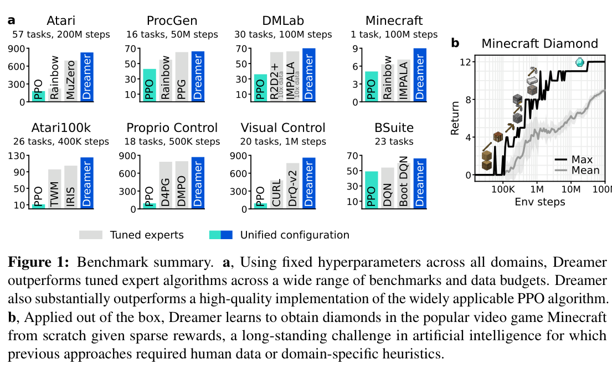
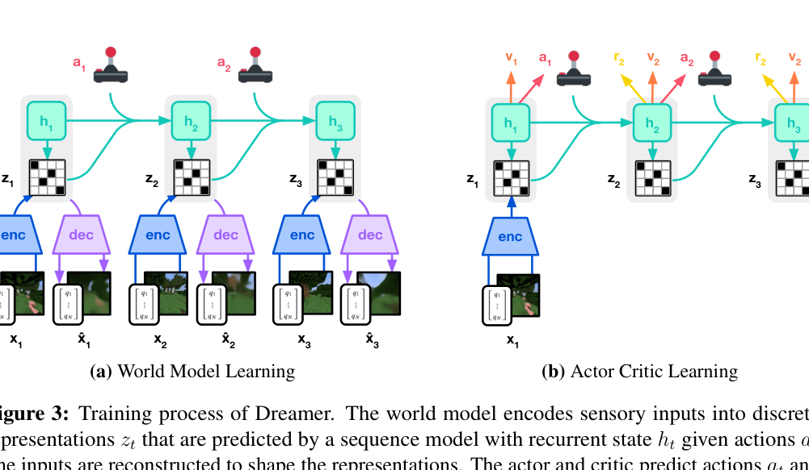
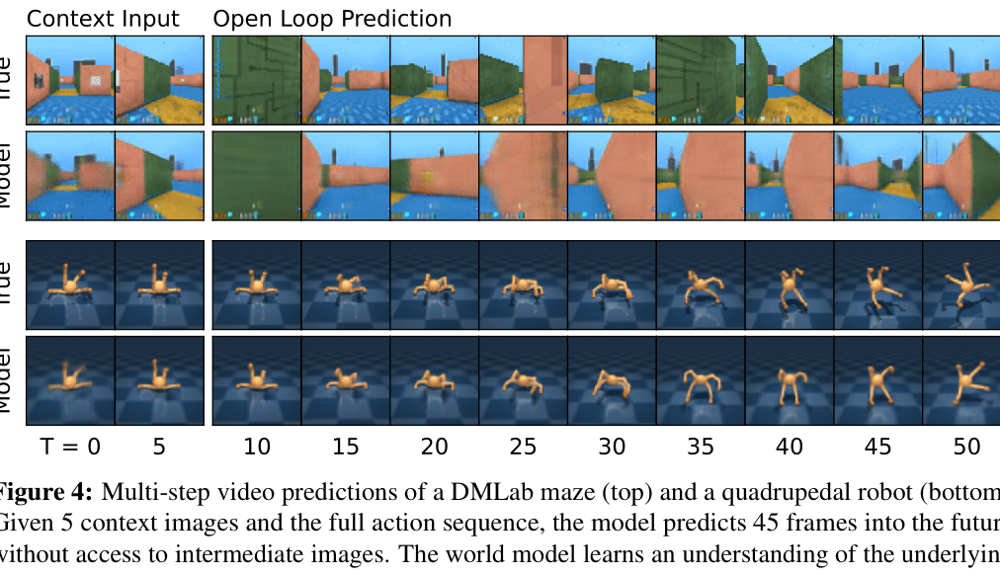
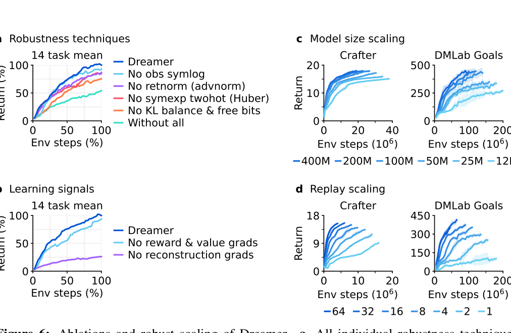

# DreamerV3：Mastering Diverse Domains through World Models

> **证据边界：**“方法、实验与结果”整理自论文；“我的理解、推测与问题”是阅读判断，不代表作者结论。

论文链接：[arXiv:2301.04104](https://arxiv.org/abs/2301.04104)

## 概述

DreamerV3 的目标和 V1、V2 有一点不同。它不再主要证明“world model 能不能做 RL”，而是追问：

> 能不能用同一套算法和同一套超参数，直接处理连续控制、Atari、DMLab、ProcGen、BSuite、Minecraft 等差异很大的环境？

不同 domain 的输入范围、reward scale、episode length、动作空间和稀疏程度差异很大。过去算法在一个 benchmark 上表现很好，换任务后经常需要重新调：

- reward clipping；
- entropy coefficient；
- KL scale；
- network size；
- value loss；
- learning rate。

DreamerV3 保留 V2 的 categorical RSSM 和 latent imagination 框架，重点加入一组稳定化设计：symlog、twohot prediction、KL balance + free bits、percentile return normalization、unimix 等。它的主要贡献是把 Dreamer 做成一套跨域更稳的 recipe。

> 图源：原论文 Figure 1。灰色柱为针对 benchmark 调过的专家算法，蓝色柱为统一配置的 DreamerV3。

---

## DreamerV2 还存在哪些问题

### 1. reward 和 observation 的数量级差异太大

不同环境可能给出：

- $[-1,1]$ 的 reward；
- 几百、几千的 reward；
- 长期几乎全为 0 的 sparse reward；
- 很大的 proprioceptive observation。

统一使用 MSE 时，大目标产生很大 gradient，可能导致训练发散；直接做 running normalization 又会让 target 随时间变化，引入非平稳性。

### 2. entropy coefficient 无法跨任务统一

Actor 目标通常写成：

$$
\text{return}+\eta\mathcal H(\pi).
$$

若 reward scale 很大，固定 $\eta$ 几乎不起作用；若 reward 很小，entropy 项可能压过任务目标。使用 advantage standardization 在 sparse reward 下还可能把极小噪声放大，导致 agent 迟迟找不到奖励。

### 3. KL regularization 需要随视觉复杂度调整

复杂 3D 场景包含许多控制无关细节，需要更强 bottleneck；像 Atari 这类小物体可能决定任务，又需要保留细节。固定 KL scale 容易出现两种问题：

- regularization 太强，丢失关键状态；
- regularization 太弱，latent 难以被 prior 预测。

### 4. value target 分布跨度大且可能多峰

单纯 MSE 回归期望值时，大 return 的梯度很大；Huber loss 又可能使远离 target 的更新过慢。不同 domain 共用一套 value head 和 loss 时，这个问题更明显。

---

## Method（方法）

DreamerV3 仍由三部分组成：

1. World Model；
2. Critic；
3. Actor。

它们从同一个 replay buffer 并行训练，但不共享梯度。

> 图源：原论文 Figure 3。

### 1. World Model：categorical RSSM

model state 为：

$$
s_t=(h_t,z_t),
$$

其中：

$$
h_t=f_\phi(h_{t-1},z_{t-1},a_{t-1}),
$$

$$
z_t\sim q_\phi(z_t\mid h_t,x_t),
$$

$$
\hat z_t\sim p_\phi(\hat z_t\mid h_t).
$$

模型还预测：

$$
\hat r_t\sim p_\phi(r_t\mid h_t,z_t),
$$

$$
\hat c_t\sim p_\phi(c_t\mid h_t,z_t),
$$

$$
\hat x_t\sim p_\phi(x_t\mid h_t,z_t).
$$

$c_t$ 是 continue flag，用于表示 episode 是否继续。图像输入用 CNN 编解码，向量输入用 MLP；stochastic representation 仍然是 categorical vector，并用 straight-through gradient。

### 2. 三类 world model loss

总 loss：

$$
\mathcal L(\phi)
=
\mathbb E_q
\sum_t
\left[
\beta_{\text{pred}}\mathcal L_{\text{pred}}
+
\beta_{\text{dyn}}\mathcal L_{\text{dyn}}
+
\beta_{\text{rep}}\mathcal L_{\text{rep}}
\right],
$$

论文使用：

$$
\beta_{\text{pred}}=1,\quad
\beta_{\text{dyn}}=1,\quad
\beta_{\text{rep}}=0.1.
$$

Prediction loss：

$$
\mathcal L_{\text{pred}}
=
-\log p_\phi(x_t\mid h_t,z_t)
-\log p_\phi(r_t\mid h_t,z_t)
-\log p_\phi(c_t\mid h_t,z_t).
$$

Dynamics loss 主要更新 prior：

$$
\mathcal L_{\text{dyn}}
=
\max
\left(
1,
D_{\mathrm{KL}}
\left[
\operatorname{sg}(q_\phi(z_t\mid h_t,x_t))
\Vert
p_\phi(z_t\mid h_t)
\right]
\right).
$$

Representation loss 主要更新 posterior：

$$
\mathcal L_{\text{rep}}
=
\max
\left(
1,
D_{\mathrm{KL}}
\left[
q_\phi(z_t\mid h_t,x_t)
\Vert
\operatorname{sg}(p_\phi(z_t\mid h_t))
\right]
\right).
$$

这相当于把 DreamerV2 的 KL balancing 进一步固定成两个独立 loss，并加入 **free bits**：当 KL 已低于 1 nat 时，不再继续压缩，让模型把优化能力放到 reconstruction、reward 和 continuation prediction 上。

### 3. 1% Unimix：避免 categorical 分布过度确定

如果 categorical probability 接近 0 或 1，KL 可能突然爆炸。DreamerV3 把 encoder 和 prior 的分布设为：

$$
p_{\text{mix}}
=
0.99\,p_{\text{network}}
+
0.01\,U,
$$

其中 $U$ 是均匀分布。

这样每个类别都保留很小的概率，分布不会变成完全 deterministic，KL 和 log probability 更稳定。

### 4. Symlog：压缩大数，同时保留符号

定义：

$$
\operatorname{symlog}(x)
=
\operatorname{sign}(x)\log(1+|x|),
$$

逆变换：

$$
\operatorname{symexp}(x)
=
\operatorname{sign}(x)(e^{|x|}-1).
$$

symlog 在零附近接近 identity，大数时按 log 压缩，且允许负值。DreamerV3 用它处理向量 observation，并用于 reward/value prediction 的 target space。

例如：

- $x=0.1$ 几乎不变；
- $x=1000$ 被压缩到约 6.9；
- $x=-1000$ 被压缩到约 -6.9。

这使同一个网络和 learning rate 能处理不同数量级。

### 5. Twohot + Symexp：把连续值预测改成分类

对于 reward 和 return，DreamerV3 不直接用 MSE 输出一个 scalar。它先在 symlog 空间设置一组等距 bucket，再通过 symexp 映射回原空间，所以原空间 bucket 呈指数间隔。

网络输出 bucket distribution：

$$
p_\theta(b_i\mid s).
$$

连续 target $y$ 被编码到最近的两个 bucket 上：

$$
\operatorname{twohot}(y)_k
+
\operatorname{twohot}(y)_{k+1}
=1.
$$

离哪个 bucket 更近，权重就更大。loss 是 soft-label cross entropy：

$$
\mathcal L_{\text{twohot}}
=
-
\operatorname{twohot}(y)^\top
\log \operatorname{softmax}(f_\theta(s)).
$$

预测值是 bucket 的概率加权平均：

$$
\hat y
=
\sum_i p_\theta(b_i\mid s)b_i.
$$

这仍然能输出连续值，但 gradient 大小主要由分类概率决定，不再随 target 数值大小线性爆炸。

### 6. Critic：$\lambda$-return + slow critic regularization

从 replay posterior state 出发，actor 和 prior 生成 imagined trajectory：

$$
(s_t,a_t,\hat r_t,\hat c_t).
$$

critic target 仍是 bootstrapped $\lambda$-return：

$$
R_t^\lambda
=
\hat r_t
+
\gamma\hat c_t
\left[
(1-\lambda)v_\psi(s_{t+1})
+
\lambda R_{t+1}^\lambda
\right].
$$

critic 使用 twohot loss 预测 return distribution。论文还用一个 critic 参数的 exponential moving average 作为 slow regularizer，作用类似 target network，但计算 return 时仍可使用当前 critic。

reward head 和 critic 的最后一层权重初始化为 0，避免训练刚开始时随机网络凭空预测巨大 reward/value。

### 7. Actor：percentile return normalization

Actor 使用 REINFORCE surrogate：

$$
\mathcal L_{\text{actor}}
=
-
\sum_t
\operatorname{sg}
\left[
\frac{R_t^\lambda-v_\psi(s_t)}
{\max(1,S)}
\right]
\log\pi_\theta(a_t\mid s_t)
-
\eta\mathcal H[\pi_\theta(\cdot\mid s_t)].
$$

关键是尺度 $S$：

$$
S
=
\operatorname{EMA}
\left(
\operatorname{Per}_{95}(R^\lambda)
-
\operatorname{Per}_{5}(R^\lambda),
0.99
\right).
$$

它取 return batch 的 95% 分位数和 5% 分位数之差，比 max-min 更不容易被 outlier 影响。

分母使用 $\max(1,S)$：

- return range 很大时，缩小 policy gradient；
- return 很小时，不把微小噪声放大。

这样 entropy coefficient 可以固定为：

$$
\eta=3\times10^{-4}.
$$

这一步是 DreamerV3 跨 sparse/dense reward 稳定的重要原因。

---

## World model 的预测效果

> 图源：原论文 Figure 4。给 5 帧 context 和完整动作序列后，模型开环预测后续 45 帧。

DMLab 的纹理和精确墙体会逐渐偏离，四足机器人的主要姿态演化仍比较连贯。论文用这个图说明 RSSM 学到了环境结构，但策略训练依然发生在 latent space，不需要生成这些可视化帧。

---

## Results（结果）

### 1. 一套超参数覆盖多种 domain

论文在七类标准 benchmark 加 Minecraft 上测试，覆盖 150+ tasks，包括：

- Atari；
- Atari100k；
- ProcGen；
- DMLab；
- DeepMind Control 的 proprioceptive 和 visual control；
- BSuite；
- Minecraft Diamond。

DreamerV3 在所有 domain 上都达到较强表现，并在其中四类 benchmark 上超过此前专门设计或调参的方法。这里的重点是统一配置，不是每个 benchmark 单独找最优超参数。

### 2. Minecraft Diamond

Minecraft 从零探索到 diamond 需要一条很长的技能链：

$$
\text{wood}
\rightarrow
\text{crafting table}
\rightarrow
\text{stone tools}
\rightarrow
\text{iron}
\rightarrow
\text{iron pickaxe}
\rightarrow
\text{diamond}.
$$

DreamerV3 不使用人类演示和手工 curriculum，只根据稀疏 reward 学习。比较中的 PPO、Rainbow、IMPALA 可以推进到 iron pickaxe，但没有发现 diamond；DreamerV3 的训练 runs 都至少发现过一次 diamond。

需要区分两个数字：

- “100% agents discover a diamond”指训练过程中每个 Dreamer run 都至少发现过一次；
- 100M steps 时，diamond 在单个 episode 中的成功率约为 0.4%。

所以这是一个明确突破，但离稳定完成任务还有较大距离。

### 3. robustness ablation 和 scaling

> 图源：原论文 Figure 6。

消融显示：

- KL balance + free bits 的平均影响最大；
- percentile return normalization 有明显贡献；
- symlog twohot 比 Huber 更稳；
- observation symlog 对部分任务重要；
- 全部去掉时性能显著下降。

Representation signal 的实验也很有意思：

- 去掉 reward 和 value gradient，性能只小幅下降；
- 去掉 reconstruction gradient，性能大幅下降。

说明 DreamerV3 的表示主要依靠 task-agnostic reconstruction 学习，而不是只靠任务奖励塑造。

### 4. scaling

论文训练 12M 到 400M 的模型。模型越大：

- final performance 更高；
- 达到相同分数所需环境交互更少。

增加 replay ratio 也能稳定提高 data efficiency。换句话说，可以用更多模型计算和训练更新，换取更少真实环境交互。这对于机器人等 environment interaction 昂贵的场景很重要。

---

## DreamerV3 相比 V2 的主要变化

| 模块 | DreamerV2 | DreamerV3 |
|---|---|---|
| observation scale | 常规预处理 | symlog |
| reward/value regression | Gaussian / scalar regression | symlog twohot distribution |
| KL | KL balancing | KL balancing + free bits + separate dyn/rep losses |
| categorical stability | 普通 softmax | 1% unimix |
| actor scale | domain-dependent entropy/gradient 设置 | percentile return normalization |
| optimizer/architecture | GRU、ELU、Adam 系列 | Block GRU、RMSNorm、SiLU、AGC、LaProp |
| 核心目标 | 在 Atari 上做强 | 固定超参数跨域工作 |

需要注意：论文的主叙事集中在几个 robustness techniques，但附录中还有网络、优化器和 replay buffer 改动。DreamerV3 的成功是整套系统工程的结果，不宜只归因于 symlog 一个公式。

---

## 我的理解、推测与问题

### 1. V3 的贡献更像“统一训练尺度”，不是新的 world model 范式

RSSM、latent imagination、actor-critic、categorical latent 都来自前两代。V3 的创新集中在不同 loss 和 gradient 的数值尺度如何协调。

这类工作看起来没有一个特别炫的单点，但实际价值很高。RL 中很多算法在原论文 benchmark 上强，换环境后就需要大量 tuning。固定配置跨域成功，比在单个任务上再涨一点分更接近通用算法。

### 2. Symlog 解决的是数量级，不解决 target 本身是否正确

symlog 可以避免大值造成 gradient 爆炸；twohot 可以稳定回归分布广的 return。它们无法修复：

- world model 预测错误；
- reward predictor 被策略利用；
- replay 数据覆盖不足；
- sparse exploration 没有发现关键状态。

所以它们是 robust optimization 技术，不是 model bias 或 exploration 的完整答案。

### 3. Percentile normalization 的设计很值得迁移

使用 5%–95% return range，有两个好处：

- outlier 不容易控制尺度；
- `max(1,S)` 只压缩大回报，不放大小回报噪声。

这个思路可以迁移到很多 RL fine-tuning 场景。尤其在多 reward model、不同 prompt group 或视频 reward 尺度差异很大时，单纯 batch standardization 可能把本来很弱的信号放得过大。

### 4. reconstruction 是主力，说明无监督预训练可能有空间

消融中去掉 reconstruction gradient 影响远大于去掉 reward/value gradient。这说明 world model 的 state representation 很大程度上是由 observation prediction 塑造的。

自然的后续问题是：

- 能否先在大量无奖励视频上预训练 world model；
- 再用少量 action/reward 数据进行 grounding；
- actor/critic 是否能直接利用预训练 dynamics；
- Genie 类 latent action 能否补充缺失动作。

这正好把 Dreamer 和 Genie 两条路线连接起来。

### 5. Minecraft 结果强，但不要过度解读

“从零学会拿钻石”说明 DreamerV3 能完成很长的行为链，确实有分量。但每局成功率仍很低，模型也不是一个泛化到任意 Minecraft 目标的通用 agent。

更合理的评价是：它证明统一 world-model RL recipe 在超长 horizon、稀疏奖励和程序生成环境中可以突破此前 baseline，而不是已经解决 Minecraft。

### 6. 总体评价

DreamerV3 是 Dreamer 系列从“有效算法”走向“可跨域使用的算法”的一步。它最值得学习的是对数值尺度、KL 梯度和 entropy-return 平衡的系统处理。对于自己做 world model 或 RL 实验，这篇论文的方法部分比最终的 Minecraft headline 更实用。

## 关联笔记

- [Dreamer V1/V2/V3 演化比较](../../../comparisons/dreamer-v1-v2-v3.md)
- [RSSM 专题](../../../topics/rssm.md)
- [Latent imagination 专题](../../../topics/latent-imagination.md)
