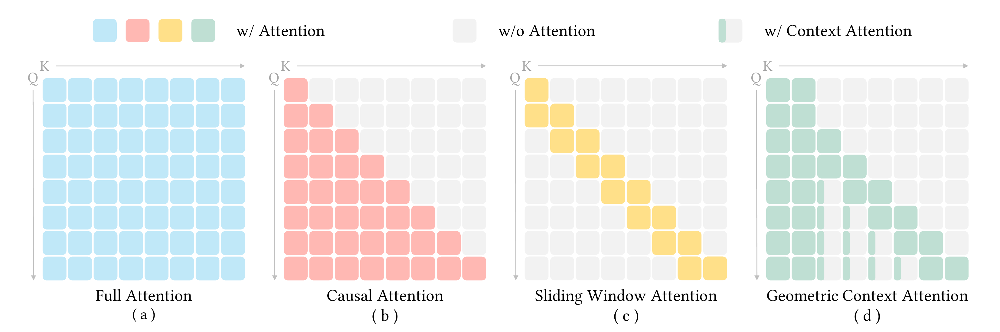
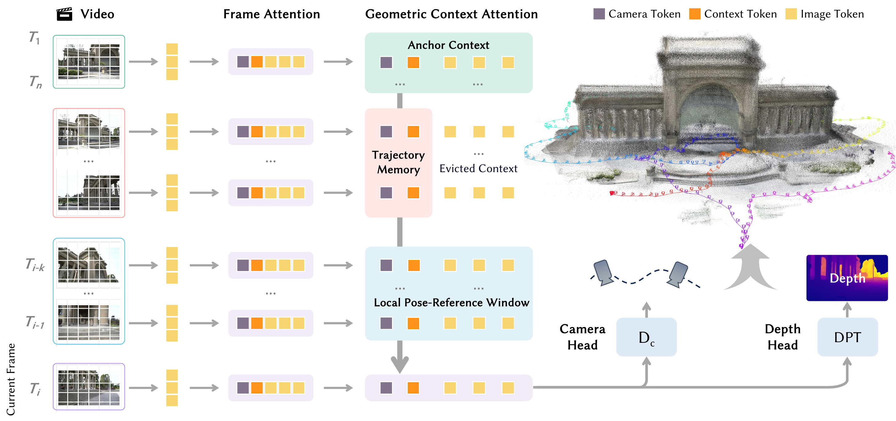
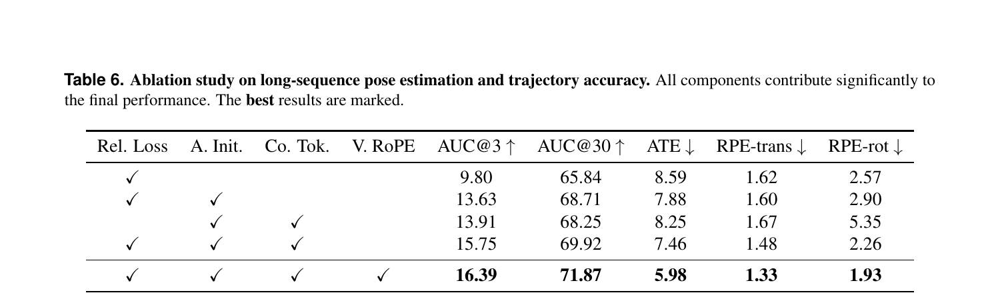
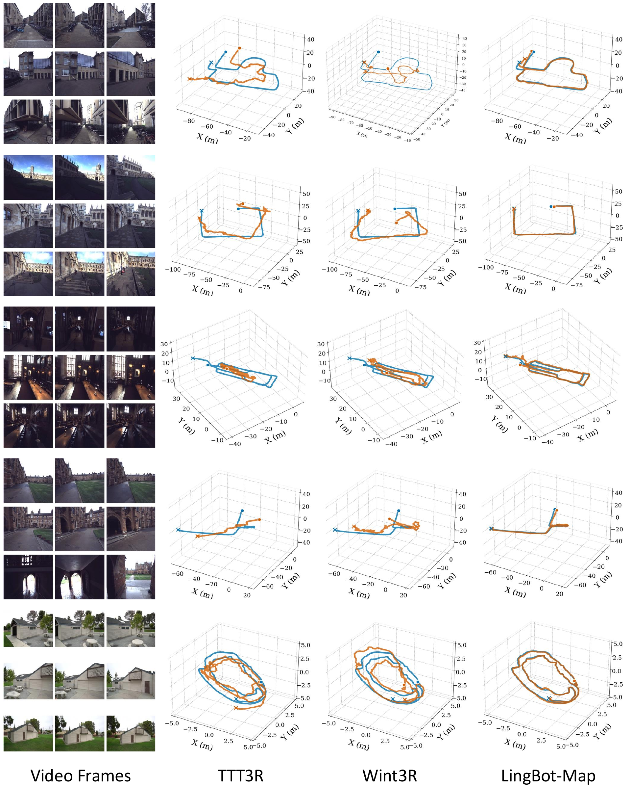

# LingBot-Map：Geometric Context Transformer

> **证据边界：**结构与指标来自 arXiv v1；与 World/VA 的互补关系属于跨论文推断。

## 一句话总结

LingBot-Map 不生成未来也不输出动作；它把经典 SLAM 的参考系、局部注册和长期轨迹职责，翻译成三类 Transformer context。

## 论文明确内容

### Geometric Context Attention

GCA 将历史分为：

1. **Anchor Context**：保留最初若干完整帧，固定坐标原点和尺度；
2. **Local Pose-Reference Window**：保留最近完整图像 token，完成局部精确注册；
3. **Trajectory Memory**：旧帧只保留少量 camera、anchor 和 register token，并用 Video RoPE 标记时间。

*来源：原论文 Figure 3。[矢量原图](../../assets/papers/lingbot-map/source/attention-masks.pdf)*

DINOv2 初始化的 ViT 提取逐帧特征，网络交替执行 Frame Attention 与 GCA；camera head 输出绝对相机位姿，depth head 输出稠密深度。训练同时使用深度、绝对位姿和 local window 内的相对位姿损失。

*来源：原论文 Figure 4。[矢量原图](../../assets/papers/lingbot-map/source/network-architecture.pdf)*

### 训练与推理

训练先从短序列 base model 开始，再将上下文扩展到最多 320 个视图。Direct mode 持续维护同一个 GCA 状态；VO mode 将超长视频划分为重叠窗口并用 Sim(3) 对齐，因此“超过 10,000 帧”不表示全程无重置。

### 结果

- Oxford Spires 的 320 帧设置中报告 AUC@15 61.64、ATE 6.42；扩展至 3,840 帧后 ATE 为 7.11。
- 论文报告推理速度约 20.29 FPS。
- ablation 显示 anchor、trajectory token、relative pose loss 和 Video RoPE 分别承担不同职责。

*来源：原论文 Table 6。*

*来源：原论文 Figure 5。[矢量原图](../../assets/papers/lingbot-map/source/long-trajectory.pdf)*

## 我的理解

长期记忆不一定意味着保存更多，而可能意味着按功能保存：anchor 管参考系，window 管局部匹配，trajectory token 管全局轨迹。这个结构比统一 KV cache 更容易解释和消融。

Map 能处理 World 生成的视频，只说明接口兼容，不说明 World 已在内部使用 Map。未来若将显式空间状态接入 World rollout 或 VA 的 future imagination，可能比简单增加视觉 context 更有效。

## 推测与问题

- 没有显式 loop closure，长期回访仍可能漂移。
- 固定数量的 trajectory token 会损失旧帧的细粒度几何。
- 方法主要面向静态几何，不直接建模动态物体和接触状态。

## 关联笔记

- [LingBot 系列演化](../../series/lingbot-series.md)
- [Action conditioning 专题](../../topics/action-conditioning.md)
