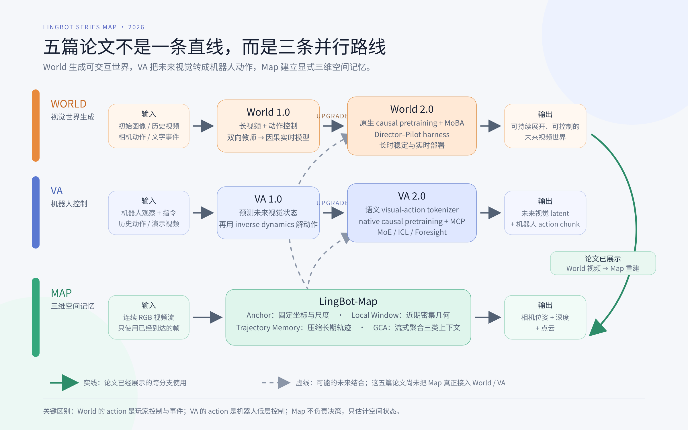

# LingBot 系列：World、VA 与 Map 的三条演化路线

## 一句话结论

五篇论文并非一条从 World 1.0 线性升级到 Map 的路线，而是三条互补分支：World 生成可交互视觉世界，VA 用未来视觉辅助机器人控制，Map 将视频流整理成稳定三维几何。

*实线表示论文已经展示的跨分支使用；虚线表示可能的未来结合。[SVG 版本](../assets/series/lingbot-series/series-overview.svg)*

## 三条分支

| 分支 | 核心问题 | 动作含义 | 输出 | 主要评价 |
|---|---|---|---|---|
| World 1.0 / 2.0 | 如何持续生成能被用户控制的视觉世界 | 相机、键鼠、角色动作、事件 | 后续视频 | 画质、稳定性、响应、速度 |
| VA 1.0 / 2.0 | 如何用未来预测帮助机器人行动 | 位姿、关节、夹爪等控制量 | 未来视觉 latent + action chunk | 成功率、进度、泛化、控制频率 |
| Map | 如何从视频流实时建立稳定三维地图 | 无外部控制动作；位姿是待估状态 | 位姿、深度、点云 | 轨迹误差、重建质量、FPS/显存 |

## World 1.0 → 2.0

| 维度 | World 1.0 | World 2.0 | 真正变化 |
|---|---|---|---|
| 教师模型 | 先做双向高质量模型 | 原生 causal pretraining | 因果结构从后期适配提前到教师训练 |
| 注意力 | block-causal adaptation | MoBA | 自回归 rollout 加双向质量正则 |
| 加速 | few-step DMD/self-rollout/GAN | consistency + long self-rollout DMD | consistency 管少步，DMD 管分布和漂移 |
| 交互 | 相机与基础键鼠 | 对象动作与环境事件 | 从导航扩展到语义交互 |
| Agent | 独立 action agent | Director + Pilot + tracking | 显式拆分高层事件与视觉渲染 |
| 长时展示 | 约 10 分钟 | 超过 1 小时 | 视觉稳定性增强，持久身份仍未解决 |

World 1.0 已使用 self-rollout DMD，因此它不是 2.0 首次提出的组件。2.0 更重要的是 causal teacher、MoBA 与重构后的实时训练链路。

## VA 1.0 → 2.0

| 维度 | VA 1.0 | VA 2.0 | 真正变化 |
|---|---|---|---|
| 视觉表示 | Wan2.2 VAE，重建优先 | semantic visual-action tokenizer | latent 同时服务语义与状态转移 |
| 视频底座 | 强视频模型后期适配 | causal DiT 从头预训练 | 从复用生成器转向原生控制预训练 |
| 动作监督 | 机器人动作数据 | robot action + latent action + human action | 扩大动作相关预训练信号 |
| 模态架构 | 双流 MoT | 双流 MoT + video sparse MoE | 控制骨架保留，扩充视频容量 |
| 预测范围 | next chunk | MCP 监督未来 1–3 chunk | 抑制相邻帧复制 |
| 任务输入 | 语言 | 语言 + 人类视频 ICL + planner | 支持更丰富的任务说明和长任务分解 |
| 闭环执行 | FDM-grounded async | Foresight Reasoning | 继承并强化，不是 2.0 才有异步校正 |

## 容易混淆的概念

### MoT、MoE 与 diffusion expert

- VA 的 MoT 按 video/action 模态分流，并在 attention 中交互。
- VA 2.0 的 sparse MoE 在 video FFN 内按 token 路由。
- World 1.0 的两个 expert 按 diffusion noise stage 分工。

### Forward simulation 与 future imagination

World 更接近“历史世界 + 外部动作 → 后续视觉世界”。VA 的主路径先生成任务期望的未来，再通过 inverse dynamics 解出动作；只有 grounding 明确执行“真实观察 + 当前动作 → 动作后的视觉结果”。

### 三种 memory

- World memory：生成历史留在视觉 context/KV cache。
- VA memory：video-action 历史表示任务进度和执行状态。
- Map memory：anchor、local window、trajectory token 分别承担坐标、注册和漂移约束。

### Causal 的边界

这些论文中的 causal 主要表示在线模型不能查看未来，适合 streaming 与 KV cache。它不自动证明模型能产生正确的反事实动作结果，也不等于学到了可迁移的物理因果机制。

## 我的综合判断

系列共同主线是“把离线视频模型变成在线系统”：chunk、causal mask、KV cache、历史压缩、异步流水线和系统加速在三条分支反复出现。

两篇 2.0 的共同判断是：不要最后才把模型改成 causal。Map 则补充了显式坐标与空间记忆，但尚未真正闭环接入 World 或 VA。

共同评价缺口仍是动作可控性：同一初始状态下，改变 action 是否会稳定、单调、可预测地改变未来，需要专门的干预实验，而不能只靠画质或任务成功率替代。

## 单篇笔记

- [LingBot-World 1.0](../papers/generative-world-models/lingbot-world-v1.md)
- [LingBot-World 2.0](../papers/generative-world-models/lingbot-world-v2.md)
- [LingBot-VA 1.0](../papers/embodied-world-models/lingbot-va-v1.md)
- [LingBot-VA 2.0](../papers/embodied-world-models/lingbot-va-v2.md)
- [LingBot-Map](../papers/spatial-world-models/lingbot-map.md)
- [反事实动作评估设计](../research/action-controllability-evaluation.md)
