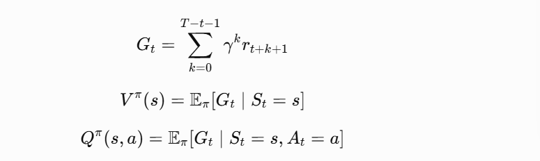
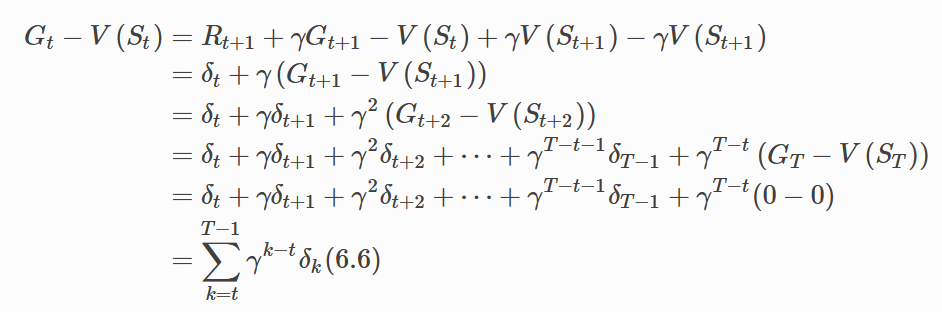
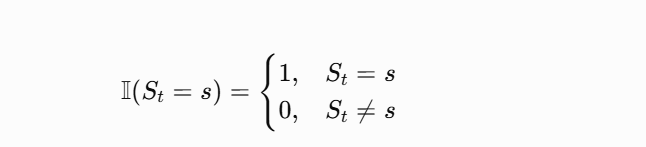
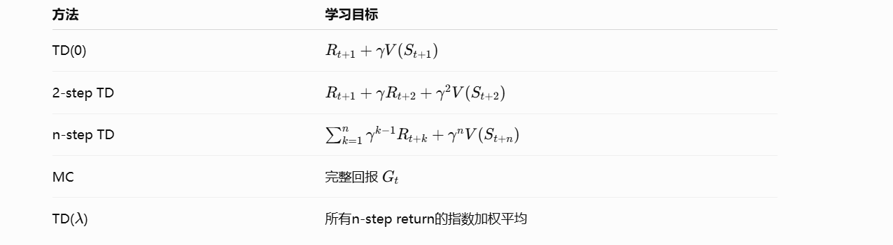
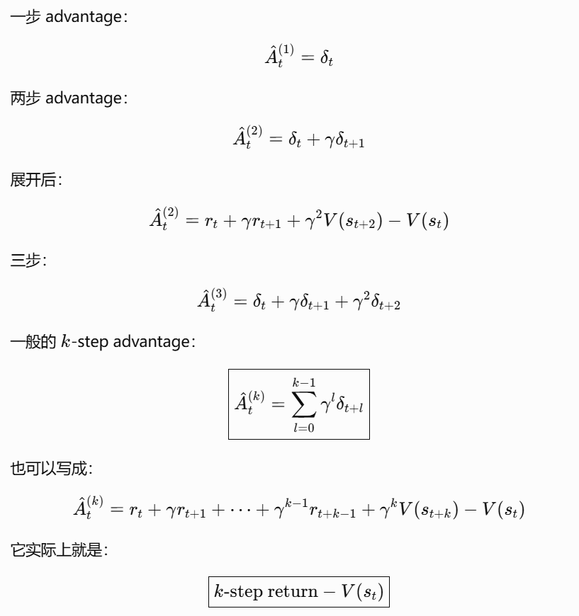
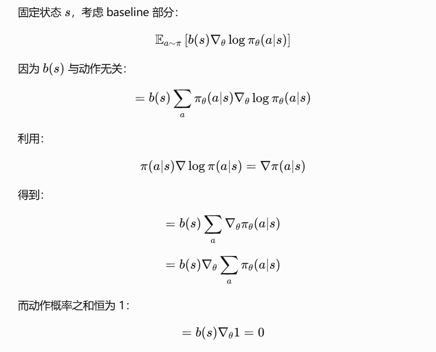
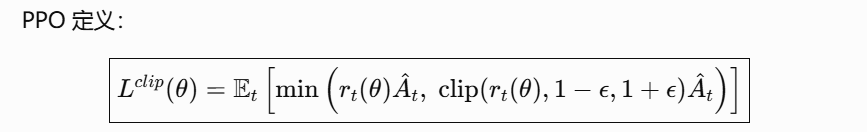

# 强化学习基础：从回报、TD 到 Policy Gradient

这份专题保留理解 Dreamer、DDPO 与信用分配所需的最小强化学习基础，而不是完整 RL 教程。

## 回报与价值

即时奖励为 $R_t$，从时刻 $t$ 开始的折扣回报为：

$$
G_t=R_{t+1}+\gamma R_{t+2}+\gamma^2R_{t+3}+\cdots.
$$

状态价值和动作价值分别为：

$$
V^\pi(s)=\mathbb E_\pi[G_t\mid S_t=s],\qquad
Q^\pi(s,a)=\mathbb E_\pi[G_t\mid S_t=s,A_t=a].
$$

*原学习材料中的符号示意；公式已在正文重写。*

优势函数衡量某动作相对当前策略平均行为的额外价值：

$$
A^\pi(s,a)=Q^\pi(s,a)-V^\pi(s).
$$

## Monte Carlo 与 Temporal Difference

Monte Carlo 等 episode 结束后使用完整回报：

$$
V(S_t)\leftarrow V(S_t)+\alpha[G_t-V(S_t)].
$$

一步 TD 使用 bootstrap：

$$
\delta_t=R_{t+1}+\gamma V(S_{t+1})-V(S_t),
$$

$$
V(S_t)\leftarrow V(S_t)+\alpha\delta_t.
$$

MC 偏差较小但方差高、更新晚；TD 更新及时、方差较低，但会继承当前 value estimate 的偏差。

## n-step return、$\lambda$-return 与 eligibility trace

n-step return 在真实 reward 与 bootstrap 之间折中：

$$
G_{t:t+n}=\sum_{k=1}^{n}\gamma^{k-1}R_{t+k}+\gamma^nV(S_{t+n}).
$$

$\lambda$-return 将不同长度的 n-step target 加权组合。前向视角对应多种 horizon 的加权，后向视角则用 eligibility trace 把当前 TD error 分给近期访问的状态：

$$
e_t(s)=\gamma\lambda e_{t-1}(s)+\mathbf 1(S_t=s),
$$

$$
V(s)\leftarrow V(s)+\alpha\delta_t e_t(s).
$$

$\lambda$ 越小越依赖短期 bootstrap；越接近 1 越接近较长回报。它扩展信用传播距离，但主要依据时间邻近性，不等于因果贡献。

## GAE

Actor-Critic 可以直接把一步 TD residual 当作 advantage estimate：

GAE 对多步 TD residual 做指数加权：

$$
\hat A_t^{\mathrm{GAE}(\gamma,\lambda)}
=\sum_{l=0}^{\infty}(\gamma\lambda)^l\delta_{t+l}.
$$

形式上 GAE 类似 TD($\lambda$)，但前者主要估计 policy update 所需的 advantage，后者通常表述为 value target。

## Policy Gradient 与 baseline

Policy gradient 的基本形式为：

$$
\nabla_\theta J(\theta)
=\mathbb E\left[\sum_t \nabla_\theta\log\pi_\theta(A_t\mid S_t)G_t\right].
$$

可将总回报换为 reward-to-go，减少与当前动作无关的过去奖励：

减去只依赖状态的 baseline 不改变期望梯度，却能降低方差；常见选择是 $V(S_t)$，此时得到 advantage。

## PPO

PPO 通过 clipped surrogate objective 限制单轮策略更新幅度：

PPO 主要解决更新稳定性，并不自动解决“最终奖励应该归因于哪些 timestep”的信用分配问题。

## 关联笔记

- [时序信用分配](temporal-credit-assignment.md)
- [Diffusion 模型中的强化学习](rl-for-diffusion-models.md)
- [Latent imagination](latent-imagination.md)
