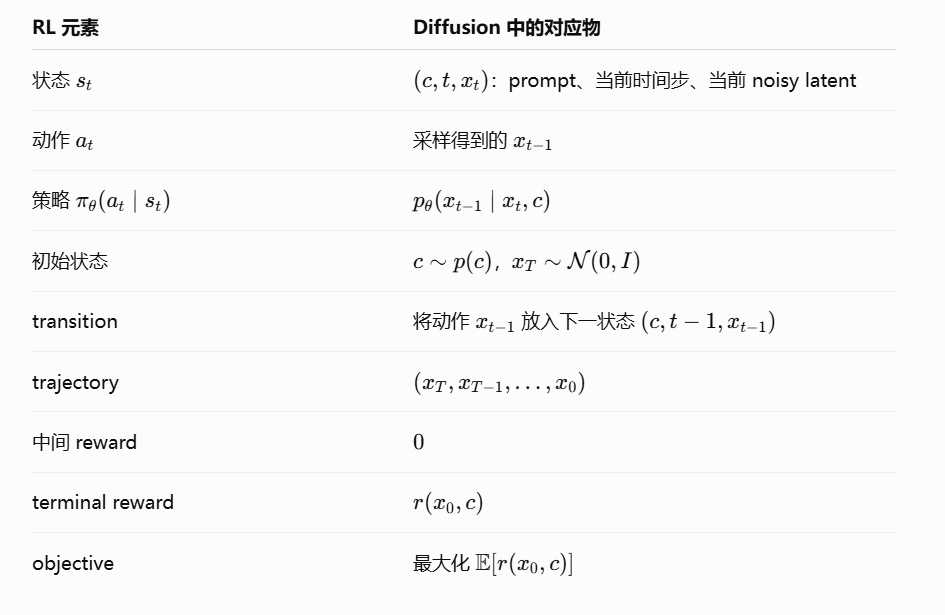
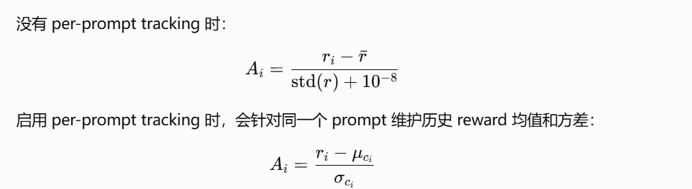

# Diffusion 模型中的强化学习：从 DDPO 到逐步信用分配

## 把去噪过程看成 MDP

DDPO 将反向扩散过程映射为有限 horizon MDP：

- state：当前 noisy sample、prompt 和 timestep；
- action：采样得到下一去噪状态；
- policy：$p_\theta(x_{t-1}\mid x_t,c,t)$；
- reward：通常只在最终图像 $x_0$ 上计算。

*来源：DDPO 相关学习材料。*

每个 reverse transition 都可以写成策略条件分布：

这样就能使用 score-function policy gradient，而不必对完整从噪声到图像的采样积分求导。

## DDPO 的策略梯度

轨迹的 log-probability 可拆成各 denoising transition 的和：

对应的训练目标把最终 reward 或 advantage 乘到每个 timestep 的 log probability 上：

实际训练常按 prompt 对多条生成轨迹的 reward 标准化，形成 group-relative advantage：

## 信用分配缺口

终局 reward 对所有 timestep 共享，意味着算法知道“这张图整体好不好”，却不知道：

- 哪些早期 step 决定了全局构图；
- 哪些后期 step 改善了纹理；
- 某一阶段是否对特定 reward model 更重要；
- 去噪状态的变化是否真正造成最终偏好提升。

UCA 直接均匀分配终局奖励；TDPO 引入 critic/baseline；CoCA 用 latent similarity 的变化构造低成本逐步权重。它们是在相同 policy-gradient 骨架上选择不同的 credit signal。

## 从图像到视频

视频生成比图像多出内容时间轴。逐步信用至少可能沿四个维度展开：

1. diffusion timestep；
2. 视频帧或 temporal chunk；
3. 空间区域或对象；
4. 动作片段。

因此只在 denoising timestep 上重加权，并不能完整解决视频中的信用分配。

## 关联笔记

- [CoCA](../papers/related-methods/step-level-reward-for-free.md)
- [时序信用分配](temporal-credit-assignment.md)
- [视频生成中的多层级信用分配](../research/video-generation-credit-assignment.md)
